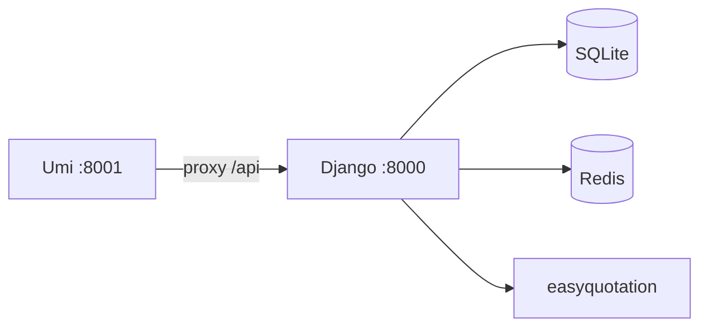

# stockManager 项目参考

个人 A 股持仓与盈亏记录工具（雪球公式），股票代码为 `sh`/`sz` 前缀。

## 仓库布局

```
stockManager/                 # Git 根
├── README.md                 # 产品说明、指标公式、本地启动
├── install.sh                # macOS/Linux：venv、migrate、Redis（不构建前端）
├── docker/                   # Compose、Dockerfile、nginx、.env.example
└── stockManager/             # 应用根（注意嵌套同名目录）
    ├── manage.py
    ├── stockManager/         # Django 项目：settings.py、urls.py
    ├── backend/              # 唯一 Django app
    ├── front/                # Umi 4 + Ant Design Pro
    ├── requirements.txt
    └── db.sqlite3
```

版本：`stockManager/stockManager/__init__.py` 与 `front/package.json`（当前 **0.9.0**）。

## 技术栈

| 层 | 技术 |
|----|------|
| 后端 | Python ≥3.11，Django **5.2**，Gunicorn（Docker） |
| 前端 | Umi Max **4.6**，**Utoopack**（`utoopack: {}`，`mfsu: false`），React **19**，antd **6**，pnpm，Node ≥20 |
| 缓存 | Redis + `django-redis`（逻辑 key 前缀由 Django 管理） |
| 数据库 | **SQLite** 仅此一种 |
| 行情 | `easyquotation` **tencent**（A 股实时）；`baostock`（除权除息） |
| 日历 | `exchange_calendars` **XSHG** |

## 架构要点

**请求路径**：Umi SPA → `/api/*` → `backend.views` → `services/integrate.py`（门面）→ `calculator` / `realtimePrice` / `cacheRepository`。

**统一响应**：`json_response(status, data, message)`，`ResponseStatus`：SUCCESS=1、ERROR=0、UNAUTHORIZED=401。装饰器：`@require_authentication`、`@require_superuser`、`@handle_exception`、`@parse_json_body`。

**认证**：Session + CSRF；前端 `credentials: 'include'`（`front/src/services/api.ts`）。

**读路径（持仓列表）**：
1. `GET /api/stocks` → `Integrate.get_calculated_result`
2. 缓存命中 → 返回 `CalculatedResult`
3. 否则：加载 `Operation` → `Calculator.calculate_stock_list`（需 `RealtimePrice.query`）→ `calculate_overall` → 写缓存

**写后失效**：`Operation` / `Info` / `CashFlow` 的 `post_save`/`post_delete` 清用户缓存（`integrate.py`）。



## 业务域（已实现）

| 域 | 关键文件 |
|----|----------|
| 交易记录 | `backend/models.py` → `Operation`（BUY/SELL/DV） |
| 盈亏计算 | `backend/services/calculator.py`（雪球规则，含 XIRR） |
| 组合汇总 | `backend/common/types.py` → `OverallData` |
| 资金流水 | `CashFlow`（存取）；`Info.INCOME_CASH`（如逆回购收益） |
| 股票元数据 | `StockMeta`（SH60、SZ00、SZ300、SH688、BJ、CONV、FUNDIN…） |
| 除权除息 | `backend/services/dividend.py` + `POST /api/dividend` |
| 实时价 | `backend/services/realtimePrice.py` |
| 缓存 | `cacheRepository.py` + `common/cache.py`；详见 `backend/缓存机制分析.md` |

**股票代码**：小写交易所前缀 + 代码，如 `sh600519`、`sz000001`。

## 修改导航（最常改哪里）

| 目标 | 改动位置 |
|------|----------|
| 新 API | `backend/views/*.py` → `backend/urls.py` → `front/src/services/api.ts` |
| 新计算字段 | `calculator.py` + `common/types.py` → `StockList` / `Data` 页面 |
| 缓存逻辑 | `cacheRepository.py`；先读 `缓存机制分析.md`；失效在 `integrate.py` |
| 行情 | `realtimePrice.py` |
| 数据库 | `models.py` → `makemigrations` → `migrate` → `backend/admin/` |
| 新前端页 | `front/config/routes.ts` + `src/pages/`；权限 `access.ts` |
| 价格展示 | `front/src/utils/renderTool.tsx`（`formatPrice`） |
| 部署/静态 404 | 改 Umi 后须 **重建 frontend 镜像**；见 `docker/nginx.conf` |

## 快速决策树（先定位再改）

- **症状：接口 401/403、登录态异常**
  - 先看：`backend/views/auth.py`、`backend/common/decorators.py`
  - 再看：`front/src/services/api.ts` 是否保留 `credentials: 'include'`
- **症状：持仓页慢/数据不刷新**
  - 先看：`backend/services/integrate.py`（是否命中缓存）
  - 再看：`backend/services/cacheRepository.py`（TTL 与 key）
  - 再看：`backend/services/realtimePrice.py`（行情源与交易时段）
- **症状：改了前端但线上没变化**
  - 先做：`docker compose build frontend && docker compose up -d frontend`
  - 原因：仅 frontend 镜像包含 Umi 构建产物
- **症状：新增字段前端拿不到**
  - 先看：`backend/common/types.py` 与 `calculator.py` 是否同步
  - 再看：`front/src/services/api.ts` 的类型定义与页面消费

## 本地开发

| 终端 | 命令 | 端口 |
|------|------|------|
| 后端 | `cd stockManager && python manage.py runserver` | **8000** |
| 前端 | `cd stockManager/front && pnpm dev` | **8001**（代理 `/api` → 8000） |

需 Redis。`install.sh` **不**执行 `pnpm build`。

**环境变量**（`stockManager/stockManager/.env`）：`DJANGO_SECRET_KEY`、`DJANGO_DEBUG`、`REDIS_URL`。Docker 另见 `SQLITE_PATH`、`CSRF_TRUSTED_ORIGINS_EXTRA` 等（`docker/.env.example`）。

**前端环境**：`UMI_ENV=dev|test|pre` → `config/config.{env}.ts`；生产 `publicPath: '/static/'`。

## Docker 部署要点

- 三服务：**redis**、**backend**（仅 API）、**frontend**（`pnpm build` + Nginx **8080**）
- **仅 frontend 镜像**含 Umi 构建产物；只重建 backend **不会**更新页面
- Nginx 反代 `/api/`、`/sys/admin/` 到 backend:8000
- 与 carSales 同机部署时设 `COMPOSE_PROJECT_NAME=stockmanager`

## API 一览

| 方法 | 路径 | 权限 |
|------|------|------|
| GET | `/api/operations` | 登录用户 |
| GET | `/api/stocks` | 登录用户 |
| POST | `/api/dividend` | 登录用户 |
| POST | `/api/updateIncomeCash` | 登录用户 |
| POST | `/api/clearCache` | superuser |
| POST | `/api/login` | 公开 |
| POST | `/api/logout` | 登录用户 |
| GET | `/api/currentUser` | 登录用户 |

Django Admin：`/sys/admin/`。应用内管理页：`/admin`（`canAdmin`）。

## 测试

**无自动化单元测试**。改完后手动验证：登录 → `/list` 持仓 → `/data` 分析 → 除权刷新 →（管理员）清缓存。前端可跑 `pnpm run lint`、`pnpm run type-check`。

建议最小检查集（改动后至少执行其一）：

1. 仅后端改动：`python manage.py check`
2. 仅前端改动：`pnpm run type-check`
3. API/计算改动：手动走通 `/list` + `/data` + `/api/clearCache`

## 编码约定

- 后端服务类用 **classmethod**（`Integrate`、`Calculator`、`RealtimePrice`、`CacheRepository`），无重度 DI
- 模型/API JSON 字段多为 **camelCase**（`operationType`、`stockType`）
- 共享工具在 `backend/common/`（`cache.py`、`decorators.py`、`types.py`、`constants.py`）
- 语言与时区：`zh-hans`、`Asia/Shanghai`
- 用户角色：`admin` | `staff` | `user`；前端 `access.ts` 控制 `canAdmin`

## 提交前自检清单（防回归）

- 是否新增/修改 API：`backend/urls.py` 与 `front/src/services/api.ts` 是否同时更新
- 是否修改模型：是否完成 `makemigrations` 与 `migrate`，并检查 admin 展示
- 是否修改计算字段：`common/types.py`、`calculator.py`、前端页面字段是否三处一致
- 是否修改缓存：是否覆盖写后失效路径（`Operation` / `Info` / `CashFlow`）
- 是否修改前端路由或静态资源：是否验证 Docker frontend 重建流程

## 更多细节

- 缓存键、TTL、失效策略：[reference.md](reference.md)
- 关键文件路径表、迁移历史、Docker 检查清单：[reference.md](reference.md)
