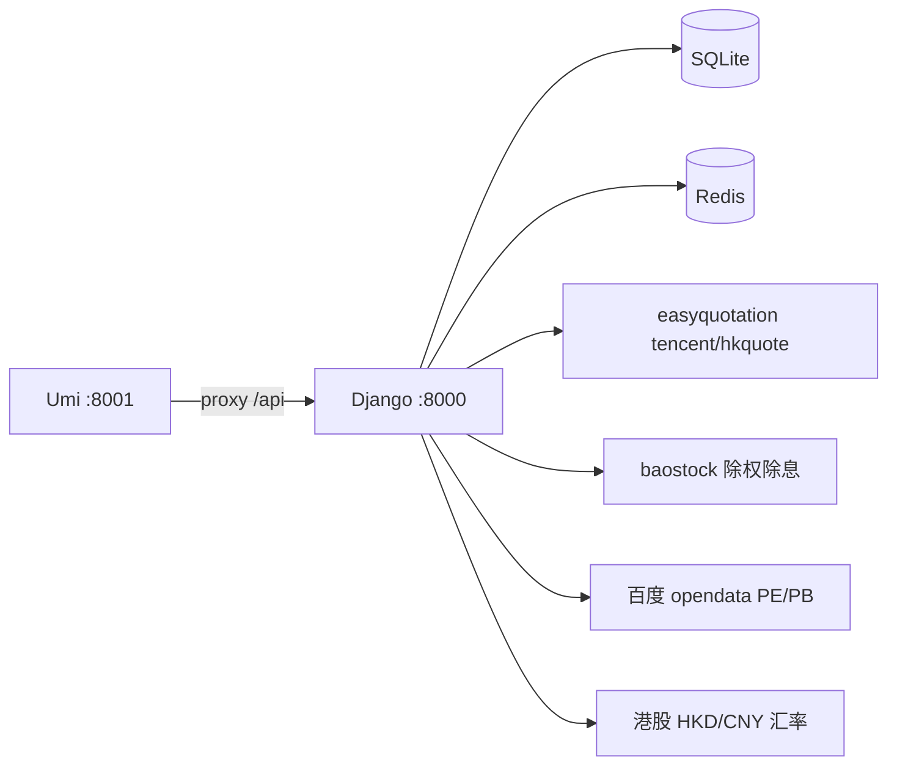

# stockManager 项目参考

个人持仓与盈亏记录工具（雪球公式），覆盖沪深 A 股 / 北交所 / 港股通；股票代码用小写前缀，如 `sh600519`、`sz000001`、`bj430047`、`hk00700`（港股按 HKD/CNY 汇率换算为人民币口径）。

## 仓库布局

```
stockManager/                 # Git 根
├── README.md                 # 产品说明、指标公式、本地启动
├── install.sh                # macOS/Linux：venv、migrate、Redis（不构建前端）
├── docker/                   # Compose、Dockerfile、nginx、.env.example
└── stockManager/             # 应用根（注意嵌套同名目录）
    ├── manage.py
    ├── stockManager/         # Django 项目：settings.py、urls.py
    ├── backend/              # 唯一 Django app
    ├── front/                # Umi 4 + Ant Design Pro
    ├── requirements.txt
    └── db.sqlite3
```

版本：`stockManager/stockManager/__init__.py` 与 `front/package.json`（当前 **1.0.0**）。

## 技术栈

| 层 | 技术 |
|----|------|
| 后端 | Python ≥3.13，Django **6.x**，Gunicorn（Docker） |
| 前端 | Umi Max **4.6**，**Utoopack**（`utoopack: {}`，`mfsu: false`），React **19**，antd **6**，utoo（`ut`），Node ≥20 |
| 缓存 | Redis + `django-redis`（逻辑 key 前缀由 Django 管理） |
| 数据库 | **SQLite** 仅此一种 |
| 行情 | `easyquotation` **tencent/hkquote**（沪深+港股实时）；`baostock`（仅 A 股除权除息）；百度 opendata（PE/PB）；腾讯 gtimg（历史高，统一 qfq）；sina 外汇（HKD/CNY） |
| 日历 | `exchange_calendars` **XSHG / XHKG**（`common/tradingCalendar.py`，CN/HK 分市场；前端右上角交易状态 Tag 走 `/api/tradingStatus`，后端统一计算） |

## 架构要点

**请求路径**：Umi SPA → `/api/*` → `backend.views` → `services/integrate.py`（门面）→ `calculation/` / `market/` / `cache/`。

**services 子包**：

| 子包 | 模块 | 说明 |
|------|------|------|
| `cache/` | `repository`（门面 `CacheRepository`）+ `keys` + 各 store | `user_store`/`price_store`/`meta_store`/`fx_store`/`valuation_store`/`hist_high_store`/`watch_store`/`refresh_policy`/`operation_codec`；逻辑 key、TTL、失效、分市场刷新 |
| `market/` | `realtimePrice`(`fetch_prices`)、`baostock_source`、`baiduValuation`、`exchangeRate`、`historicalHigh`、`http_client` | 外部数据源适配（仅拉取与标准化，不含缓存编排），多为**模块级函数** |
| `calculation/` | `calculator`、`overall`、`single_stock`、`single_metrics`、`money_weighted`、`stockHold`、`constants` | 盈亏、组合汇总、单股指标、资金加权、持仓推算 |
| 根目录 | `integrate`、`dividend` | 编排与除权 |

**统一响应**：`json_response(status, data, message)`，`ResponseStatus`：SUCCESS=1、ERROR=0、UNAUTHORIZED=401。装饰器：`@require_authentication`、`@require_superuser`、`@handle_exception`、`@parse_json_body`。

**认证**：Session + CSRF；前端 `credentials: 'include'`（`front/src/services/api.ts`）。

**读路径（持仓列表）**：
1. `GET /api/stocks` → `Integrate.get_calculated_result`
2. 缓存命中 → 返回 `CalculatedResult`（含 `stocks` / `overall` / `markets`）
3. 否则：加载 `Operation` → `CacheRepository.load_calculation_inputs`（聚合现金流、汇率、行情 `price_store.query_prices`→`fetch_prices`、元数据、各市场状态）→ `Calculator.calculate_stock_list` → `calculate_overall` → 写缓存

**写后失效**：信号在 `cache/` 内（**非** `integrate.py`）。`cache/user_store.py` 的 `post_save`/`post_delete` 清 `Operation` / `CashFlow` / `Info`（仅 `INCOME_CASH`）用户缓存；`cache/meta_store.py` 清 `StockMeta` 全量元数据；`cache/watch_store.py` 清 `WatchItem` 关注列表缓存。



## 业务域（已实现）

| 域 | 关键文件 |
|----|----------|
| 交易记录 | `backend/models.py` → `Operation`（BUY/SELL/DV；港股通买卖 `price` 为 HKD、`amount` 为实际 CNY 成交额、`fee` 为 CNY） |
| 盈亏计算 | `backend/services/calculation/calculator.py`（雪球规则，含 XIRR） |
| 组合汇总 | `backend/common/types.py` → `OverallData` |
| 资金流水 | `CashFlow`（存取）；`Info.INCOME_CASH`（如逆回购收益） |
| 股票元数据 | `StockMeta`（SH60、SZ00、SZ300、SH688、BJ、CONV、FUNDIN、FUNDAB、HK、OTHER） |
| 除权除息 | `backend/services/dividend.py` + `POST /api/dividend`（仅 A 股自动生成；港股分红在 Admin 手动录入 DV，`cash` 为每股 CNY 到账） |
| 实时价 | `backend/services/market/realtimePrice.py`（`fetch_prices`，沪深+港股） |
| 关注列表 | `WatchItem` 模型 + `GET /api/watchlist`；`cache/watch_store.py`、前端 `pages/Watch/`（risk/opportunity/leftPoint/trendPoint/bloodPoint） |
| 估值 PE/PB | `market/baiduValuation.py`（`fetch_pe_pb`）+ `cache/valuation_store.py` |
| 历史高价 | `market/historicalHigh.py`（gtimg 周线 qfq）+ `cache/hist_high_store.py` |
| 港股/汇率 | `common/market.py`（CN/HK 抽象）、`common/settlement.py`（CNY 资金账 + 原币展示账）、`market/exchangeRate.py` + `cache/fx_store.py`（`fx:hkd_cny`） |
| 缓存 | `services/cache/` + `common/cache.py`；详见 [references/cache.md](references/cache.md) |

**股票代码**：小写交易所前缀 + 代码，如 `sh600519`、`sz000001`、`bj430047`、`hk00700`。后端将港股严格识别为 `hk` + 5 位数字；录入以此规则为准。

**港股通口径**：`price`、每股成本为 HKD；港股 BUY/SELL 的 `amount` 为实际 CNY 成交额、`fee` 为 CNY。市值、盈亏、组合汇总和 XIRR 均为 CNY；市值按当前 HKD/CNY 汇率换算，成交时的 CNY 金额不随汇率重算。

## 修改导航（最常改哪里）

| 目标 | 改动位置 |
|------|----------|
| 新 API | `backend/views/`（仅 `stock.py` / `user.py`）→ `backend/urls.py` → `front/src/services/api.ts` |
| 新计算字段 | `calculation/calculator.py`（或 `overall`/`single_stock`/`single_metrics`）+ `common/types.py` → `StockList` / `ProfitAnalysis` / `Transaction` 页面；港股结算口径同时检查 `common/settlement.py` |
| 缓存逻辑 | `services/cache/`（`repository` 门面 + 各 `*_store`）；先读 [references/cache.md](references/cache.md)；失效信号在 `cache/user_store.py`、`cache/meta_store.py`、`cache/watch_store.py` |
| 行情/估值/汇率 | `market/`（`realtimePrice`/`baiduValuation`/`exchangeRate`/`historicalHigh`/`baostock_source`），缓存编排在对应 `cache/*_store.py` |
| 关注列表 | `models.WatchItem` → `cache/watch_store.py` → `views/stock.watchlist` → 前端 `pages/Watch/` |
| 数据库 | `models.py` → `makemigrations` → `migrate` → `backend/admin/` |
| 新前端页 | `front/config/routes.ts` + `src/pages/`；权限 `access.ts` |
| 价格展示 | `front/src/utils/format/stock.ts`（`formatMarketPrice` / `formatAmount` / `isHkCode`） |
| 部署/静态 404 | 改 Umi 后须 **重建 frontend 镜像**；见 `docker/nginx.conf` |

## 快速决策树（先定位再改）

- **症状：接口 401/403、登录态异常**
  - 先看：`backend/views/user.py`、`backend/common/decorators.py`
  - 再看：`front/src/services/api.ts` 是否保留 `credentials: 'include'`
- **症状：持仓页慢/数据不刷新**
  - 先看：`backend/services/integrate.py`（是否命中缓存）
  - 再看：`backend/services/cache/`（TTL 与 key）
  - 再看：`backend/services/market/realtimePrice.py`（行情源与交易时段）
- **症状：改了前端但线上没变化**
  - 先做：`docker compose build frontend && docker compose up -d frontend`
  - 原因：仅 frontend 镜像包含 Umi 构建产物
- **症状：新增字段前端拿不到**
  - 先看：`backend/common/types.py` 与 `calculation/calculator.py` 是否同步
  - 再看：`front/src/services/api.ts` 的类型定义与页面消费

## 本地开发

| 终端 | 命令 | 端口 |
|------|------|------|
| 后端 | `cd stockManager && python manage.py runserver` | **8000** |
| 前端 | `cd stockManager/front && ut run dev` | **8001**（代理 `/api` → 8000） |

需 Redis。`install.sh` **不**执行 `ut run build`。

**环境变量**（`stockManager/stockManager/.env`）：`DJANGO_SECRET_KEY`、`DJANGO_DEBUG`、`REDIS_URL`。Docker 另见 `SQLITE_PATH`、`CSRF_TRUSTED_ORIGINS_EXTRA` 等（`docker/.env.example`）。

**前端环境**：`UMI_ENV=dev|test|pre` → `config/config.{env}.ts`；生产 `publicPath: '/static/'`。

## Docker 部署要点

- 三服务：**redis**、**backend**（仅 API）、**frontend**（`ut run build` + Nginx **8080**）
- **仅 frontend 镜像**含 Umi 构建产物；只重建 backend **不会**更新页面
- Nginx 反代 `/api/`、`/sys/admin/` 到 backend:8000
- 与 carSales 同机部署时设 `COMPOSE_PROJECT_NAME=stockmanager`

## API 一览

| 方法 | 路径 | 权限 |
|------|------|------|
| GET | `/api/operations` | 登录用户 |
| GET | `/api/stocks` | 登录用户 |
| GET | `/api/watchlist` | 登录用户 |
| POST | `/api/watchlist/hidden` | 登录用户 |
| GET | `/api/tradingStatus` | 登录用户 |
| POST | `/api/dividend` | 登录用户 |
| POST | `/api/updateIncomeCash` | 登录用户 |
| POST | `/api/clearCache` | superuser |
| POST | `/api/login` | 公开 |
| POST | `/api/logout` | 登录用户 |
| GET | `/api/currentUser` | 登录用户 |

Django Admin：`/sys/admin/`（`canAdmin` 用户从头像菜单新窗口打开；**无**独立 `/admin` 前端路由）。

## 测试

**无自动化单元测试**。改完后手动验证：登录 → `/list` 持仓 → `/profit-analysis` 盈亏归因 → `/transaction` 交易数据 → 除权刷新 →（管理员）清缓存。前端可跑 `ut run lint`、`ut run type-check`。

建议最小检查集（改动后至少执行其一）：

1. 仅后端改动：`python manage.py check`
2. 仅前端改动：`ut run type-check`
3. API/计算改动：手动走通 `/list` + `/profit-analysis` + `/transaction` + `/api/clearCache`

## 编码约定

- 编排/计算类用 **classmethod**（`Integrate`、`Calculator`、`StockHold`、`Dividend`、`CacheRepository`），无重度 DI；行情/汇率/缓存 store 层为**模块级函数**（如 `fetch_prices`、`price_store.query_prices`、`fx_store.get_hkd_cny_rate`）
- 模型/API JSON 字段多为 **camelCase**（`operationType`、`stockType`）
- 共享工具在 `backend/common/`（`cache.py`、`decorators.py`、`types.py`、`constants.py`、`market.py`(CN/HK 抽象)、`tradingCalendar.py`、`utils.py`）
- 语言与时区：`zh-hans`、`Asia/Shanghai`
- 用户角色：`admin`（superuser）| `staff` | 普通用户（`access` 为空字符串）；前端 `access.ts` 控制 `canAdmin`

## 提交前自检清单（防回归）

- 是否新增/修改 API：`backend/urls.py` 与 `front/src/services/api.ts` 是否同时更新
- 是否修改模型：是否完成 `makemigrations` 与 `migrate`，并检查 admin 展示
- 是否修改计算字段：`common/types.py`、`calculator.py`、前端页面字段是否三处一致
- 是否修改缓存：是否覆盖写后失效路径（`Operation` / `Info` / `CashFlow` / `StockMeta` / `WatchItem`）
- 是否修改前端路由或静态资源：是否验证 Docker frontend 重建流程

## 深度参考（按需阅读）

| 场景 | 文档 |
|------|------|
| 路径索引 / 部署 / 迁移 / 排障 | [references/reference.md](references/reference.md) |
| 缓存 key / TTL / 失效 / 交易时段刷新 | [references/cache.md](references/cache.md) |
| 外部数据源 / market 层 / 失败行为 | [references/external-data.md](references/external-data.md) |
| 前端主题 / 明暗切换 / 盈亏颜色 / less | [references/theme.md](references/theme.md) |
