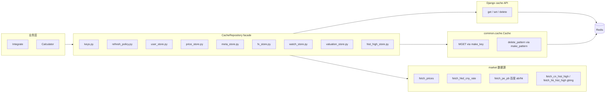

# Backend 缓存机制完整分析

> 范围：`stockManager/backend` 目录下实际生效的缓存相关实现（键设计、数据内容、过期策略、失效策略、调用路径、代码结构）。外部数据源详见 [external-data.md](external-data.md)。

## 阅读指引

- **改缓存 key / TTL / 失效**：优先查 §9 策略速查表；新增缓存走 §10 检查清单
- **持仓不刷新 / 价格过期**：读 §5.1 交易时段逻辑失效与典型场景表
- **查读写路径**：读 §6；market 拉取细节见 [external-data.md](external-data.md)

## 1. 总览：缓存分层与职责

当前后端缓存是一个 **两层结构**：

1. **Django Cache（业务接口层）**
  - 业务与 `CacheRepository` 统一使用 **逻辑 key**（如 `user:1:operations`），单条通过 `cache.get` / `cache.set` / `cache.delete`；批量读写通过 `Cache.get_many` / `Cache.set_many`。
  - 由 Django 根据 `KEY_PREFIX`、`VERSION` 自动拼出 Redis 完整 key，业务代码无需关心前缀。
2. **Redis 原生能力（优化层）**
  - 批量读、按模式删除在 `backend/common/cache.py` 中通过 `get_redis_connection` 直连 Redis。
  - 完整 key / pattern 统一用 `cache.make_key` 或 `Cache.make_pattern` 生成，**不再手写** `stockmanager:1:` 之类字符串。

对应代码分工：

| 层级 | 文件 | 职责 |
| --- | --- | --- |
| 配置 | `stockManager/settings.py` | `RedisCache`、`KEY_PREFIX`、`VERSION`、JSON 序列化 |
| 工具 | `backend/common/cache.py` | `make_key` / `make_pattern`、`get_many`（MGET）、`set_many`（Pipeline）、`delete_pattern` |
| 仓库 | `backend/services/cache/` | 逻辑 key、TTL、读写/失效；对外 `from services.cache import CacheRepository` |
| 业务 | `integrate.py`、`market/`、`calculation/`、`dividend.py` | 经 `CacheRepository` 使用缓存；`market/` 仅拉取与标准化，不含缓存编排 |
| 接口 | `backend/views/stock.py` | `/api/stocks`、`/api/watchlist` 读缓存；`POST /api/clearCache` 全量清理 |



### 1.1 缓存子包结构（`backend/services/cache/`）

| 文件 | 职责 |
| --- | --- |
| `keys.py` | 逻辑 key 模板与 TTL 常量 |
| `operation_codec.py` | Operation JSON 序列化/反序列化（含 detached ModelState） |
| `refresh_policy.py` | 价格时间戳读写、`should_refresh_market`（`is_trading_time_passed`）、`is_in_trading_hours` |
| `user_store.py` | 用户 operations、cash_info、calculated_target 读写与失效信号 |
| `price_store.py` | 股价批量读写、写价后更新时间戳并清全用户计算结果 |
| `meta_store.py` | StockMeta 全量缓存、名称日同步标记与信号 |
| `fx_store.py` | 港币汇率 `fx:hkd_cny` 读写 |
| `watch_store.py` | 用户关注列表缓存与 `WatchItem` 信号 |
| `valuation_store.py` | 单股估值 epsTtm/bvps 缓存 |
| `hist_high_store.py` | 单股近 6 年历史最高价缓存 |
| `repository.py` | `CacheRepository` 门面，聚合各 store 编排调用 |

### 1.2 services 层分组

| 子包 | import 示例 |
| --- | --- |
| `cache/` | `from services.cache import CacheRepository` |
| `market/` | `from services.market import fetch_prices, fetch_hkd_cny_rate, fetch_pe_pb, fetch_cn_hist_high, fetch_hk_hist_high, fetch_dividends` |
| `calculation/` | `from services.calculation import Calculator, StockHold` |
| 根目录 | `integrate.py`、`dividend.py` |

## 2. 基础配置与 key 约定

### 2.1 settings 配置

在 `settings.py` 中：

- 后端：`django_redis.cache.RedisCache`
- `LOCATION`：环境变量 `REDIS_URL`
- 序列化：`JSONSerializer`
- 命名空间：`KEY_PREFIX='stockmanager'`，`VERSION=1`

Redis 中实际 key 示例（由框架生成，**不要在业务里拼接**）：

- `stockmanager:1:user:123:operations`
- `stockmanager:1:stock:price:sh600519`

### 2.2 逻辑 key vs 完整 key（开发约定）

| 场景 | 使用方式 |
| --- | --- |
| 单条读写 | 只传逻辑 key，与 `keys.py` 常量一致 |
| `Cache.set_many` | 入参为逻辑 key 映射；内部 `make_key` + 与 `cache.set` 相同的序列化与超时 |
| `Cache.get_many` | 入参为逻辑 key 列表；内部 `cache.make_key` 后 `MGET` |
| `Cache.delete_pattern` | 默认 `logical=True`，传逻辑通配符如 `user:*:calculated_target`、`*` |
| 调试 Redis | 可用 `Cache.make_key('user:1:operations')` 查看完整 key |

`keys.py` 中所有 `KEY_*` 常量均为 **逻辑 key 模板**，格式化后交给 Django 或 `Cache` 工具层处理。

## 3. 缓存内容清单（缓存什么）

`keys.py` 定义的核心缓存对象：

1. **用户操作流水**
  - Key：`user:{user_id}:operations`
  - 内容：按股票代码分组后的 `Operation` 列表（JSON 字符串存库，读出后反序列化为带 `ModelState` 的实例）
  - 用途：操作列表、收益计算、分红生成
2. **用户现金信息**
  - Key：`user:{user_id}:cash_info`
  - 内容：`income_cash`、`cash_flow_list`
  - 用途：收益汇总 `calculate_overall`
3. **用户计算结果（聚合）**
  - Key：`user:{user_id}:calculated_target`
  - 内容：`{"stocks": ..., "overall": ..., "markets": {cn, hk}}`（`CalculatedResult`）
  - 用途：`/api/stocks` 直接返回，避免重复计算
4. **用户关注列表**
  - Key：`user:{user_id}:watchlist`
  - 内容：`WatchItem` 字段列表（code / risk / opportunity / leftPoint / trendPoint / bloodPoint）
  - 用途：`/api/watchlist` 读 DB 配置项；行情/估值/历史高由 `load_watchlist_market_data` 另行聚合
5. **股票元数据全量字典**
  - Key：`stock:meta:all`
  - 内容：`{code: {code, name, isNew, stockType}}`
  - 用途：避免反复全表读 `StockMeta`
6. **股票实时价格（单票）**
  - Key：`stock:price:{code}`
  - 内容：`RealtimePriceData`（name / currentPrice / priceOffset / offsetRatio / yesterdayClose / yearHigh）
  - 用途：持仓计算、关注列表展示；由 `price_store.query_prices` 经 `load_calculation_inputs` / `load_watchlist_market_data` 间接使用
7. **股票价格时间戳（分市场）**
  - Key：`stock:price:timestamp:cn`、`stock:price:timestamp:hk`
  - 内容：上海时区 ISO 时间字符串
  - 用途：按 CN/HK 独立判断价格缓存是否“逻辑过期”
8. **港币汇率**
  - Key：`fx:hkd_cny`
  - 内容：`float`（1 HKD = X CNY）
  - 用途：港股通 Overall 汇总折算；非交易时段读缓存，交易时段强制回源 API
9. **股票名称日同步标记**
  - Key：`stock:name:sync:mark`
  - 内容：`True`（布尔标记）
  - 用途：限制「根据实时行情回写名称」24 小时内最多一次
10. **单股估值指标**
  - Key：`stock:valuation:{code}`
  - 内容：`{epsTtm, bvps}`（`ValuationData`）
  - 用途：关注列表 PE/PB 计算；A 股与港股均走百度 opendata（market=ab / hk）
11. **单股历史最高价**
  - Key：`stock:hist_high:{code}`
  - 内容：`float` 或哨兵值 `__none__`（表示 API 无数据，避免反复回源）
  - 用途：关注列表 histHigh；A 股与港股均走 gtimg 周线（qfq / bfq）

## 4. TTL 策略

`keys.py` 常量：

| 常量 | 秒数 | 说明 |
| --- | --- | --- |
| `TTL_USER_DATA` | 36000 | 用户 operations / cash_info / watchlist，10 小时 |
| `TTL_CALCULATED_TARGET` | 86400 | 计算结果，24 小时 |
| `TTL_STOCK_META` | 86400 | 元数据全量，24 小时 |
| `TTL_STOCK_PRICE` | 86400 | 单票价格与时间戳，24 小时 |
| `TTL_STOCK_NAME_SYNC` | 86400 | 名称同步标记，24 小时 |
| `TTL_FX` | 86400 | 港币汇率，24 小时 |
| `TTL_VALUATION` | 604800 | 单股估值（epsTtm/bvps），7 天；PE/PB 展示仍随 realtime 现价现算 |
| `TTL_HIST_HIGH` | 2592000 | 单股历史高价，30 天 |

补充：

- 多个 key 虽为 24h TTL，**是否命中还受交易时段逻辑失效约束**（见下节），逻辑上可能早于物理过期。
- 估值与历史高价无独立主动失效，依赖 TTL 自然过期或 `clear_all()`。

## 5. 刷新 / 失效策略

### 5.1 交易时段驱动的逻辑失效（分市场 CN / HK）

核心：`refresh_policy.should_refresh_market(market)`，按本批代码涉及的市场独立判断。**唯一规则**：自上次成功拉价起，若区间 `[last_time, now]` 与任意**交易日**的开收盘时段有交集，则该市场视为需刷新；否则走缓存。

#### 判定流程

```text
should_refresh_market(market)
  ├─ 无 stock:price:timestamp:{market} → 刷新
  └─ 有 timestamp → TradingCalendar.is_trading_time_passed(last, now, market)
        逐日遍历 [last 日期 .. now 日期]
          ├─ 非交易日（周末 / 法定假日 / 交易所休市）→ 跳过
          └─ 交易日 → 检查是否与上午盘或下午盘时段重叠
                有重叠 → 刷新
        全程无重叠 → 命中缓存
```

#### 交易日与开收盘时段

| 项目 | 说明 |
| --- | --- |
| 交易日来源 | `exchange_calendars` 的 **XSHG**（A 股）、**XHKG**（港股），`calendar.is_session(date)` |
| 法定假日 | 已含在 sessions 内；周中法定假日**不是**交易日（如春节、国庆） |
| 调休补班 | A 股补班日仍不开盘，亦不在 sessions 内 |
| A 股时段 | 9:30–11:30、13:00–15:00（上海时区，`[start, end)`） |
| 港股时段 | 9:30–12:00、13:00–16:00（上海时区，`[start, end)`） |

实现见 `backend/common/tradingCalendar.py`：`is_trading_day`、`is_trading_time_passed`、`is_in_trading_hours_at`。

#### 典型场景

| 场景 | 是否刷新 |
| --- | --- |
| 无 timestamp（首次拉价） | ✅ |
| 10:00 → 12:00（经过上午盘） | ✅ |
| 10:00 → 10:05（仍在上午盘内） | ✅ |
| 12:00 → 12:30（午休，无交易时段） | ❌ |
| 12:00 → 13:30（经过下午盘） | ✅ |
| 节前最后交易日 16:00 → 国庆当日 10:00 | ❌ |
| 节前最后交易日 16:00 → 节后首个交易日 10:00 | ✅ |

`price_store._get_cached_prices` 仅对本批 `code_list` 中出现的市场做上述判断；CN/HK 独立。

#### 关联行为

| 模块 | 行为 |
| --- | --- |
| `price_store.query_prices` | `should_refresh_market` 为 False 时 MGET 命中 `stock:price:{code}` |
| `user_store.get_calculated_target` | 持仓涉及任市场 `should_refresh_market` 为 True → 返回 `None`（强制重算） |
| `user_store.set_calculated_target` | 持仓涉及**所有**市场当前均不在交易时段（`is_in_trading_hours_at(now)`）才写入 |
| `fx_store.get_hkd_cny_rate` | 持仓涉及任市场**当前**在交易时段 → 跳过读缓存、强制回源 |
| `price_store.get_markets_metadata` | 返回各市场 `inTradingHours`、`priceUpdatedAt` 供前端展示 |

纯 A 股用户不受港股 15:00–16:00 时段影响；反之亦然。

解决「TTL 未过但中间已发生交易时段，旧价/旧收益不应继续用」的问题。

### 5.2 数据变更驱动的主动失效

| 触发源 | 行为 |
| --- | --- |
| `Operation` / `CashFlow` / `Info(INCOME_CASH)` 的 `post_save` / `post_delete`（`user_store.py` 信号） | `clear_user_cache`（operations、cash_info、calculated_target） |
| `Integrate.update_income_cash` | 更新 `Info` 后由上述 `Info` 信号触发，无需手动清缓存 |
| `StockMeta` 的 `post_save` / `post_delete`（`meta_store.py` 信号） | `clear_stock_meta_all` |
| `WatchItem` 的 `post_save` / `post_delete`（`watch_store.py` 信号） | `clear_user_watchlist` |
| `price_store._set_prices_batch` 写价后 | `refresh_policy.set_price_timestamp` + `user_store.clear_all_calculated_targets`（pattern `user:*:calculated_target`） |
| `meta_store.sync_names_from_realtime` 有名称变更并 `bulk_update` 后 | `clear_stock_meta_all` + 写入 `stock:name:sync:mark` |
| `POST /api/clearCache` | `CacheRepository.clear_all()` → `delete_pattern("*")` 删除本应用命名空间下全部 key |

### 5.3 失效链示意（价格更新）

```text
price_store.query_prices → _get_cached_prices（逻辑失效检查）
  → missing 走 market.fetch_prices（easyquotation）
  → _set_prices_batch
       → Cache.set_many(各 stock:price:{code})
       → refresh_policy.set_price_timestamp（涉及市场）
       → user_store.clear_all_calculated_targets（所有用户的 calculated_target）
       → meta_store.sync_names_from_realtime（可选名称回写）
```

保证价格变更后不会继续返回基于旧价的聚合收益缓存。

## 6. 读写路径与命中行为

### 6.1 用户操作与计算结果

`views/stock.py` → `Integrate.get_calculated_result`：

1. `get_user_operations`（cache-aside）
2. `get_calculated_target(user, user_codes)`（内含 `should_invalidate_calculated_cache` / 交易时段判断）
3. 未命中 → `CacheRepository.load_calculation_inputs` 聚合：
   - `get_user_cash_info`
   - `fx_store.get_hkd_cny_rate`
   - `price_store.query_prices`
   - `meta_store.get_stock_meta_dict`
   - `price_store.get_markets_metadata`
4. `Calculator.calculate_stock_list(prices=...)` / `calculate_overall`
5. `set_calculated_target`（当前不在交易时段才写入；见 §5.1）

`/api/stocks` 主要依赖 `calculated_target`；两次请求之间若经过交易时段，`should_refresh_market` 为 True，会强制重算以保证价格时效。

`Integrate.get_operations`、`generate_dividend` 仅使用 `get_user_operations`，不读 `calculated_target`。

### 6.2 实时价格（批量读 + 写）

`price_store.query_prices(code_list)`：

1. `_get_cached_prices` → 按市场调用 `refresh_policy.should_refresh_market` → `Cache.get_many`
2. 缓存数据须包含完整 `_PRICE_FIELDS`（含 `yearHigh`），否则视为 miss
3. 命中部分直接返回；`missing` 走 `market.fetch_prices`（easyquotation tencent/hkquote）
4. `_set_prices_batch` 回写、刷新时间戳、清全用户 `calculated_target`，并触发 `sync_names_from_realtime`

**批量读**：`Cache.get_many(逻辑 keys)` → `make_key` + Redis `MGET` + `client.decode`；未命中为 `None`；异常时降级为逐 key `cache.get`（`price_store` 记录 `logger.error`）。

**批量写**：`Cache.set_many(逻辑 key 映射)` → Pipeline 内逐条走 `cache.client.set`（与单条 `cache.set` 相同的 `make_key`、JSON 序列化、`px` 超时）；异常时降级为逐 key `cache.set`。

### 6.3 股票名称同步

`price_store.query_prices` 回源写价后 → `meta_store.sync_names_from_realtime`：

- 24 小时内已同步（`stock:name:sync:mark` 存在）→ 跳过
- 无名称变更 → 仅写入 `stock:name:sync:mark`
- 有变更 → `bulk_update` → `clear_stock_meta_all` → 写入标记

### 6.4 关注列表

`views/stock.py` → `Integrate.get_watchlist`：

1. `watch_store.get_user_watchlist`（cache-aside）
2. `CacheRepository.load_watchlist_market_data(codes)` 聚合（估值与历史高两组并行，各自内部有界并发 8）：
   - `price_store.query_prices`（共用 §6.2 逻辑失效）
   - `valuation_store.fetch_and_cache_valuations`（miss 回源百度 opendata：A 股 ab / 港股 hk）
   - `hist_high_store.fetch_and_cache_hist_highs`（miss 回源 gtimg 周线：A 股 qfq / 港股 bfq）
   - 不再依赖 baostock（baostock 仅用于除权除息）
3. 与持仓状态、用户配置合并后返回

关注列表**不缓存**聚合后的行情/估值/历史高结果，仅缓存 DB 中的 `WatchItem` 配置。

### 6.5 计算器与行情

`Calculator.calculate_stock_list` 接收 `load_calculation_inputs` 预取的 `prices`，**不再自行调用行情 API**。计算链路依赖 `price_store` 缓存与 §5.1 的逻辑失效，**不单独维护**计算器级缓存。

## 7. 底层工具与健壮性

`backend/common/cache.py`：

| 方法 | 作用 | 失败时 |
| --- | --- | --- |
| `make_key` / `make_pattern` | 逻辑 key / 通配 → Redis 完整形式 | — |
| `get_many` | `MGET` + `client.decode`（与 `cache.get` 同链路） | 逐 key `cache.get` |
| `set_many` | Pipeline + `client.set`（逻辑 key） | 逐 key `cache.set` |
| `delete_pattern` | `KEYS` + `DELETE`，默认逻辑 pattern | 返回 0，不抛异常 |

注意：`KEYS` 在 key 数量极大时可能阻塞 Redis；当前规模可接受，规模增大时可改为 `SCAN` 分批删除。

仓库层 `price_store._get_cached_prices` 在 `get_many` 异常时有 `logger.error` 降级日志；工具层其余失败路径静默回退。

## 8. 评估：优点与待改进点

### 8.1 优点

- **集中式缓存仓库**：key、TTL、失效集中在 `cache/` 各 store，`CacheRepository` 对外编排简单。
- **逻辑 key 统一**：前缀/版本由 `make_key` / `make_pattern` 与 Django cache 承担，避免与 settings 漂移。
- **实时与性能平衡**：交易时段逻辑失效 + 非交易时段批量 MGET。
- **失效链完整**：用户数据、价格时间戳、元数据、关注列表、管理员清缓存均有覆盖。
- **market 与 cache 分离**：外部数据源适配在 `market/`，缓存编排在 `cache/*_store.py`，职责清晰。

### 8.2 待改进点（非阻塞，日常改动可跳过）

1. **pattern 删除使用 KEYS** — 数据量大时改 `SCAN`。
2. **Operation 反序列化** — `operation_codec` 用 `Operation.__new__` + `ModelState`，与 ORM 内部结构耦合；可考虑缓存 DTO，在上层再转模型。
3. **异常与监控** — 工具层大量吞异常；可对回退次数、pattern 删除失败做指标/告警。
4. **估值/历史高价无主动失效** — 目前仅 TTL；若数据源更新频率需更细控制，可补充失效策略。

## 9. 策略速查表

| 缓存项 | 逻辑 Key | TTL | 读取策略 | 失效策略 |
| --- | --- | --- | --- | --- |
| 用户操作 | `user:{id}:operations` | 10h | miss 查 DB 并写缓存 | `user_store` 信号（Operation/CashFlow/Info） |
| 用户现金 | `user:{id}:cash_info` | 10h | 同上 | 同上 |
| 计算结果 | `user:{id}:calculated_target` | 24h | 持仓涉及市场 `should_refresh_market` 为 True 则失效；否则命中 | 用户数据变更；分市场价格时间戳更新后 pattern 清全用户 |
| 关注列表 | `user:{id}:watchlist` | 10h | miss 查 DB 并写缓存 | `watch_store` 信号（WatchItem） |
| 元数据全量 | `stock:meta:all` | 24h | miss 全表加载并缓存 | `meta_store` 信号；名称同步有变更 |
| 实时价格 | `stock:price:{code}` | 24h | 批量 MGET；`should_refresh_market` 为 False 且字段完整则命中 | §5.1 按市场逻辑失效；TTL 自然过期 |
| 价格时间戳 | `stock:price:timestamp:cn` / `:hk` | 24h | 记录上次成功拉价时间，供 `is_trading_time_passed` | 批量写价时更新涉及市场 |
| 港币汇率 | `fx:hkd_cny` | 24h | 当前不在交易时段读缓存 | `clear_all()`；当前在交易时段强制 API 更新 |
| 名称日同步 | `stock:name:sync:mark` | 24h | 控制 24h 内最多同步一次 | TTL 自然过期 |
| 单股估值 | `stock:valuation:{code}` | 7 天 | miss 回源百度 opendata（ab/hk） | TTL 自然过期；`clear_all()` |
| 单股历史高价 | `stock:hist_high:{code}` | 30 天 | miss 回源 gtimg 周线（qfq/bfq） | TTL 自然过期；`clear_all()` |

## 10. 新增缓存时的检查清单

1. 在 `backend/services/cache/keys.py` 增加逻辑 key 与 `TTL_*`（如需）；读写逻辑放在对应 `*_store.py`，对外 API 经 `repository.CacheRepository` 暴露。
2. 单条读写用 `cache.get/set/delete`；批量读写用 `Cache.get_many` / `Cache.set_many`；模式删除用 `Cache.delete_pattern`。
3. 明确是否需要接入 `refresh_policy.should_refresh_market` 或 Django 信号失效（参考 `user_store` / `meta_store` / `watch_store`）。
4. 勿在业务代码手写 `stockmanager:1:`；调试时用 `Cache.make_key`。
5. 同步更新本文档（`references/cache.md`）第 3、9 节表格。

## 11. 关键代码入口索引

- 缓存配置：`stockManager/settings.py`（`CACHES`）
- 缓存仓库：`backend/services/cache/repository.py`（`CacheRepository`）
- 逻辑 key / TTL：`backend/services/cache/keys.py`
- 刷新策略：`backend/services/cache/refresh_policy.py`
- 各 store：`user_store.py`、`price_store.py`、`meta_store.py`、`fx_store.py`、`watch_store.py`、`valuation_store.py`、`hist_high_store.py`
- Redis 工具：`backend/common/cache.py`
- 交易时段：`backend/common/tradingCalendar.py`
- 市场抽象：`backend/common/market.py`（CN/HK 分市场）
- 业务编排：`backend/services/integrate.py`
- 行情拉取：`backend/services/market/realtimePrice.py`（`fetch_prices`）
- 汇率：`backend/services/market/exchangeRate.py`（`fetch_hkd_cny_rate`）
- 估值：`backend/services/market/baiduValuation.py`（A 股 ab / 港股 hk）；历史高：`historicalHigh.py`（gtimg）
- 历史高价：`backend/services/market/historicalHigh.py`
- 收益计算：`backend/services/calculation/calculator.py`
- API：`backend/views/stock.py`（`get_stocks`、`get_watchlist`、`clear_cache`）
