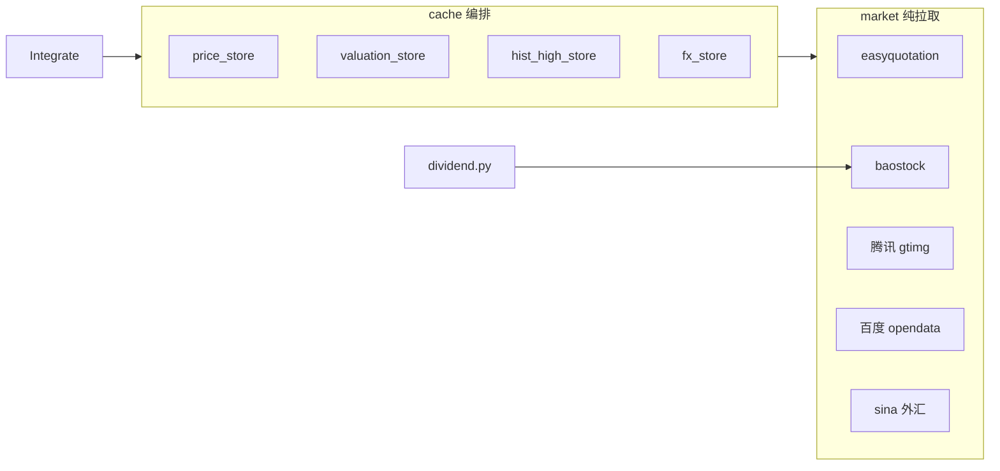

# 外部数据获取

> 范围：`stockManager/backend/services/market/` 纯拉取层 + `services/cache/` 缓存编排 + `services/dividend.py` 除权业务。缓存键与 TTL 详见 [cache.md](cache.md)。

## 阅读指引

- **改行情源 / 估值 / 汇率 / 除权**：先看下方「30 秒速查」，再读 §3 各源说明与 §5 失败行为
- **查 API 用了哪些外部数据**：直接看 §4 调用路径
- **改缓存编排**：读 [cache.md](cache.md) §5–§6，本文仅描述 market 拉取层

## 30 秒速查（数据源 × 市场）

| 数据类型 | A 股 | 港股 | market 模块 | 缓存 key | TTL |
|---------|------|------|-------------|----------|-----|
| 实时价 | easyquotation `tencent` | easyquotation `hkquote` | `realtimePrice.fetch_prices` | `stock:price:{code}` | 86400s |
| PE/PB（epsTtm/bvps） | 百度 opendata `market=ab` | 百度 opendata `market=hk` | `baiduValuation` | `stock:valuation:{code}` | 604800s（7 天） |
| 6 年历史最高 | 腾讯 gtimg 周线前复权（qfq） | 腾讯 gtimg 周线前复权（qfq） | `historicalHigh` | `stock:hist_high:{code}` | 2592000s（30 天） |
| HKD/CNY 汇率 | — | sina `fx_shkdcny` | `exchangeRate.fetch_hkd_cny_rate` | `fx:hkd_cny` | 86400s |
| 除权除息 | baostock `query_dividend_data` | 不支持 | `baostock_source.fetch_dividends` | 无（直写 DB） | — |

> watchlist 路径（估值 + 历史高）已全部走 HTTP 源（百度 / gtimg）并行拉取；**baostock 现仅用于除权除息**。

## 1. 架构分层

- **market/**：仅负责外部拉取与字段标准化，不含 Redis 逻辑。
- **cache/**：按 key/TTL 做 read-through；`Integrate` 经 `CacheRepository` 门面调用。
- **dividend.py**：除权除息业务编排（持仓判定、去重、写库），拉取委托 `market.baostock_source`。

## 2. 数据源 × 市场对照

（与「30 秒速查」相同，供章节内交叉引用。）

| 数据类型 | A 股 | 港股 | market 模块 | 缓存 key | TTL |
|---------|------|------|-------------|----------|-----|
| 实时价 | easyquotation `tencent` | easyquotation `hkquote` | `realtimePrice.fetch_prices` | `stock:price:{code}` | 86400s |
| PE/PB（epsTtm/bvps） | 百度 opendata `market=ab` | 百度 opendata `market=hk` | `baiduValuation` | `stock:valuation:{code}` | 604800s（7 天） |
| 6 年历史最高 | 腾讯 gtimg 周线前复权（qfq） | 腾讯 gtimg 周线前复权（qfq） | `historicalHigh` | `stock:hist_high:{code}` | 2592000s（30 天） |
| HKD/CNY 汇率 | — | sina `fx_shkdcny` | `exchangeRate.fetch_hkd_cny_rate` | `fx:hkd_cny` | 86400s |
| 除权除息 | baostock `query_dividend_data` | 不支持 | `baostock_source.fetch_dividends` | 无（直写 DB） | — |

## 3. 各源说明

### easyquotation（实时价）

- **文件**：`market/realtimePrice.py`
- **A 股**：`use('tencent').real(codes, prefix=True)` → `currentPrice`、`yesterdayClose`；`yearHigh` 取自 `high_2` 字段。
- **港股**：`use('hkquote').real([5位代码])`；`yearHigh` 取自 `year_high` 字段。
- **实例复用**：easyquotation 实例经模块级 `_quotations` 字典缓存，避免重复初始化。
- **刷新策略**（`price_store`）：按市场 CN/HK 调用 `refresh_policy.should_refresh_market` → `TradingCalendar.is_trading_time_passed`；自上次成功拉价起，若 `[last_time, now]` 与任意交易日开收盘时段有交集则回源，否则 MGET 命中 `stock:price:{code}`。写价后 `set_price_timestamp` 并 `clear_all_calculated_targets`。详见 [cache.md](cache.md) §5.1。

### baostock（仅除权除息）

- **文件**：`market/baostock_source.py`
- **会话**：`baostock_session()` 上下文统一 `login/logout`。
- **除权**：`fetch_dividends` — 按年 `query_dividend_data`，返回 `{date, cash, reserve, stock}` 行列表。

### 百度 opendata（A 股 + 港股 PE/PB）

- **文件**：`market/baiduValuation.py`
- **统一**：`fetch_pe_pb(pure_code, market)`，A 股 `market=ab`、港股 `market=hk`；指标名 `市盈率(TTM)` / `市净率`。
- **store**：`valuation_store` 以 `to_baidu_params(code)` 自动判定市场，`base_close` 取实时行情 `yesterdayClose`，换算 `epsTtm=close/peTTM`、`bvps=close/pbMRQ`，有界并发（8）。
- **HTTP**：经 `market/http_client.get_json` 线程本地 Session。

### 腾讯 gtimg（A 股 + 港股历史高）

- **文件**：`market/historicalHigh.py`
- **A 股**：`fetch_cn_hist_high(shXXXXXX/szXXXXXX)` — 6 年周线前复权（`qfq`），endpoint `fqkline/get`。
- **港股**：`fetch_hk_hist_high(hkXXXXX)` — 6 年周线前复权（`qfq`），**专用 endpoint `hkfqkline/get`**（注意：`fqkline/get` 对港股 `qfq` 静默忽略，仍返回不复权数据，故港股必须走 `hkfqkline/get`）。
- **store**：`hist_high_store` 按市场分派 endpoint，统一前复权，有界并发（8）。
- **HTTP**：经 `market/http_client.get_json` 线程本地 Session。

### sina 外汇（HKD/CNY）

- **文件**：`market/exchangeRate.py`
- **接口**：`https://hq.sinajs.cn/list=fx_shkdcny`，须带 `Referer: https://finance.sina.com.cn/`。
- **解析**：响应 `var hq_str_fx_shkdcny="名称,现价,..."`，第 2 字段为 HKD/CNY。
- **HTTP**：经 `market/http_client.get_text` 共享 Session。
- **缓存配合**：`fx_store` 非交易时段**优先读** Redis `fx:hkd_cny`（命中则不发请求）；持仓涉及任市场当前在交易时段则强制回源并回写。拉取失败异常上抛（无失败后回落缓存），由视图层 `@handle_exception` 兜底。

## 4. 调用路径

| API / 功能 | 入口 | 外部数据 |
|-----------|------|---------|
| `GET /api/stocks` | `Integrate.get_calculated_result` | 实时价、汇率（非交易时段读缓存，交易时段回源） |
| `GET /api/watchlist` | `Integrate.get_watchlist` | 实时价、估值、历史高 |
| `POST /api/dividend` | `Integrate.generate_dividend` | baostock 除权除息 |

## 5. 失败行为

| 源 | 失败时 |
|----|--------|
| easyquotation | 记录 error 日志，返回空 dict，页面缺价 |
| baostock | 记录 error 日志，单 code 返回 None |
| 百度 / gtimg | 记录 error 日志，返回 None；hist 写 `__none__` sentinel 防重复请求 |
| sina 外汇 | 抛异常（解析失败 / 无效汇率均 raise），由视图层 `@handle_exception` 兜底；非交易时段因优先读缓存通常不触发请求 |

## 6. 依赖

| 库 | 用途 |
|----|------|
| easyquotation | A/H 实时价 |
| baostock | 仅除权除息 |
| requests | `http_client`（百度、gtimg、sina） |

已移除：**akshare**（汇率改 sina）。
