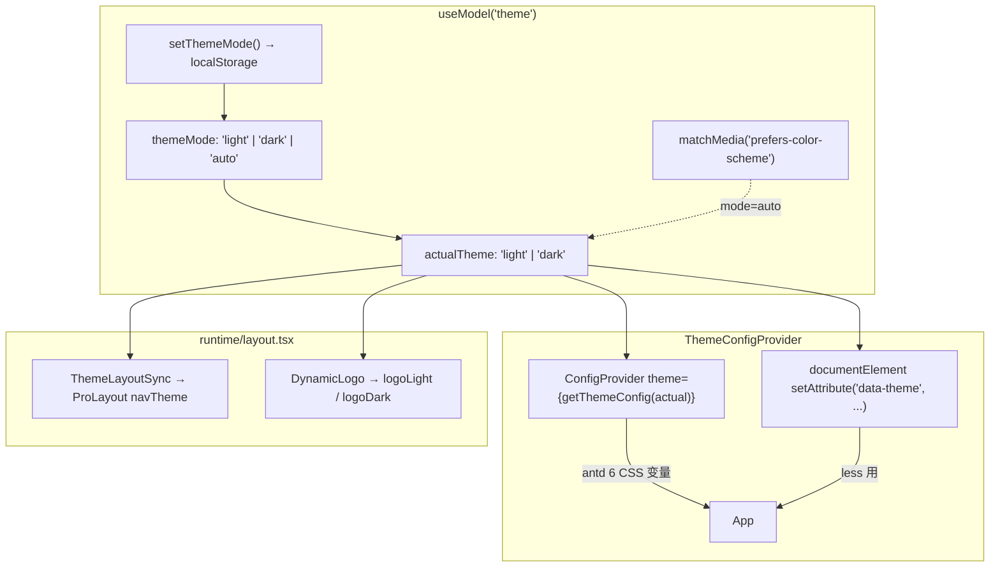

# 前端主题系统

> 范围：`stockManager/front/` 下主题相关实现（状态、token、Provider、less、盈亏颜色、构建配置）。

## 阅读指引

- **改主题色 / 组件 token**：先看 §2 主题 Token + §1 模型接口
- **主题切换出 bug**：看 §3 Provider 注入 + §4 ProLayout 同步 + §12 颜色可靠性
- **新增暗夜 less 样式**：看 §7 Less 覆盖规则 + §8 CSS 变量模式
- **调盈亏颜色**：看 §6 盈亏颜色体系
- **新增主题感知页**：看 §8 CSS 变量模式 + §9 最佳实践（参考 Account 页）
- **改 Logo / 默认配置**：看 §10 + §11

## 文件索引

| 文件 | 职责 |
|------|------|
| `front/src/models/theme.ts` | 主题状态（light/dark/auto），localStorage 持久化 |
| `front/src/theme/themeConfig.ts` | antd 两套 ThemeConfig + providerComponentConfig + Tabs 覆盖 |
| `front/src/runtime/providers.tsx` | `ThemeConfigProvider`：ConfigProvider + `data-theme` 注入 |
| `front/src/components/ThemeLayoutSync.tsx` | 同步 `actualTheme` → ProLayout `navTheme` |
| `front/src/components/RightContent/ThemeSwitch.tsx` | 顶部 Dropdown 三模式切换 |
| `front/src/components/RightContent/index.less` | 顶部右侧操作区 less（含 `.dark` 主题覆盖） |
| `front/src/hooks/useProfitLossColors.ts` | 红涨绿跌颜色 hook（profitColor/lossColor/highlightStyle/warningStyle） |
| `front/src/runtime/layout.tsx` | `DynamicLogo` 明暗 Logo 切换 + `childrenRender` |
| `front/src/global.less` | 全局 CSS 变量用法 + 移动端适配 |
| `front/src/styles/variables.less` | Less 变量（构建期全局自动注入） |
| `front/src/components/Common/modal/index.less` | `[data-theme='dark']` 选择器（分隔线/表头暗夜覆盖） |
| `front/src/pages/Account/index.less` | 账户页，`var(--ant-color-*)` 主题感知 less（最佳实践参考） |
| `front/src/pages/Login/index.less` | 登录页，固定白天主题（外层 `ConfigProvider theme={lightThemeConfig}`） |
| `front/config/defaultSettings.ts` | ProLayout 默认配置（Logo URLs 等） |
| `front/config/config.ts` | `antd.style: 'css'` + `lessLoader.additionalData` |

## 架构总览



- **热切换**：antd 6 `style: 'css'`，不改 `key` 不 remount，无闪烁
- `ThemeLayoutSync` 用 `useLayoutEffect`（非 `useEffect`），与 token 同帧落盘，避免 ProLayout 旧 `navTheme` 闪一帧

## 1. 主题状态（`models/theme.ts`）

类型：`ActualTheme = 'light' | 'dark'`，`ThemeMode = ActualTheme | 'auto'`

| 要点 | 说明 |
|------|------|
| 存储 | `localStorage`，key `stock-manager-theme-mode` |
| 默认 | `'auto'`（跟随系统） |
| 系统检测 | `window.matchMedia('(prefers-color-scheme: dark)')` |
| 自动响应 | `mode === 'auto'` 时监听 `change` 事件同步 `actualTheme` |

对外接口：`{ themeMode, actualTheme, setThemeMode }`。

## 2. 主题 Token（`theme/themeConfig.ts`）

### 常量与语义

| 常量 | 值 | 用途 |
|------|-----|------|
| `PRIMARY_COLOR` | `#1677ff` | 主色，与 `variables.less`、`defaultSettings.ts` 同步 |
| `STOCK_LOSS_COLOR` | `#389e0d` | 下跌绿（白天），略深于 antd 默认 success |
| `STOCK_LOSS_COLOR_DARK` | `#3c8618` | 下跌绿（暗夜） |

**注意**：`colorSuccess` = 下跌绿，与 `colorError`（涨红）语义互换，适配中国股市习惯。

### 共享组件覆盖

| 组件 | 覆盖项 |
|------|--------|
| Layout | `headerHeight: 56`, `headerBg: '#ffffff'`, `bodyBg: '#f5f7fa'` |
| Menu | `itemSelectedColor` = `PRIMARY_COLOR`, `horizontalItemSelectedColor` = `PRIMARY_COLOR` |
| Table | `headerBg: '#fafafa'`, `headerColor: 'rgba(0,0,0,0.88)'`, `rowHoverBg: '#f5f7fa'`, `borderColor: '#f0f0f0'`, `cellPaddingBlock: 12`, `cellPaddingInline: 12` |
| Card | `paddingLG: 20` |
| Statistic | `titleFontSize: 13`, `contentFontSize: 28` |
| Tabs | `inkBarColor` = `PRIMARY_COLOR`, `itemSelectedColor` = `PRIMARY_COLOR`, `itemHoverColor` = `PRIMARY_COLOR` |

### 暗夜覆盖（仅差异项）

| Token / 组件 | 白天 | 暗夜 |
|-------------|------|------|
| `colorBgLayout` | `#f5f7fa` | `#141414` |
| `colorBgContainer` | `#ffffff` | `#1f1f1f` |
| `colorSuccess` | `#389e0d` | `#3c8618` |
| `colorText` | `rgba(0,0,0,0.88)` | `rgba(255,255,255,0.85)` |
| `colorTextSecondary` | `rgba(0,0,0,0.65)` | `rgba(255,255,255,0.65)` |
| Layout `headerBg` | `#ffffff` | `#1f1f1f` |
| Layout `bodyBg` | `#f5f7fa` | `#141414` |
| Table `headerBg` | `#fafafa` | `#262626` |
| Table `headerColor` | `rgba(0,0,0,0.88)` | `rgba(255,255,255,0.85)` |
| Table `rowHoverBg` | `#f5f7fa` | `#262626` |
| Table `borderColor` | `#f0f0f0` | `#303030` |

导出：`getThemeConfig(actualTheme)` + `providerComponentConfig`（mask blur 恢复 antd 6.0~6.2 行为）→ 由 §3 Provider 消费。

## 3. Provider 注入（`runtime/providers.tsx`）

`app.tsx` 通过 `innerProvider` 注册，包裹整棵 React 树：

```
ThemeConfigProvider
├─ documentElement.setAttribute('data-theme', actualTheme)  // useLayoutEffect
├─ ConfigProvider theme={getThemeConfig(actualTheme)}        // CSS 变量热切换
├─ providerComponentConfig                                   // mask blur
└─ App
```

**不**用 `key={actualTheme}` remount：antd 6 CSS 变量模式天然热切换，remount 会清空子树状态且让 navTheme/data-theme 慢一帧。

## 4. ProLayout 同步（`ThemeLayoutSync.tsx`）

```typescript
useLayoutEffect(() => {
  const navTheme = actualTheme === 'dark' ? 'realDark' : 'light';
  setInitialState((state) => ({
    ...state,
    settings: {
      ...defaultSettings,
      ...state?.settings,
      navTheme,
      colorPrimary: PRIMARY_COLOR,
      fixedHeader: true,
    },
  }));
}, [actualTheme, setInitialState]);
```

在 `layout.tsx` 的 `childrenRender` 中渲染，与 token 同帧生效，避免 ProLayout `navTheme` 闪旧值。

## 5. 主题切换 UI（`ThemeSwitch.tsx`）

顶部 `RightContent` 内 Dropdown，三项：

| 模式 | 标签 | 图标 |
|------|------|------|
| `light` | 白天模式 | `SunOutlined` |
| `dark` | 暗夜模式 | `MoonFilled` |
| `auto` | 跟随系统 | `DesktopOutlined` |

`selectedKeys` 高亮当前项，`onClick` → `setThemeMode(key)`。

## 6. 盈亏颜色体系

中国股市红涨绿跌，与 antd 默认语义相反：

| 方向 | 对应 token | 白天色值 | 暗夜色值 |
|------|-----------|----------|----------|
| 涨（盈利） | `colorError` | `#ff4d4f` | `#a61d24` |
| 跌（亏损） | `colorSuccess` | `#389e0d` | `#3c8618` |

`useProfitLossColors()` hook 返回 `{ profitColor, lossColor, colorFromValue(v), highlightStyle, warningStyle }`。所有盈亏组件（`HoldingsList`、`OverallBoard`、`AnalysisList`、`TradeDetailModal`、`StockProfitModal` 等）统一通过此 hook 取色，随主题自动切换。

## 7. Less 暗夜覆盖

### `[data-theme='dark']` 选择器

仅需绕过 antd token 的 less 中使用，当前两处：

| 文件 | 覆盖内容 |
|------|----------|
| `modal/index.less` | 分隔线 `border-top-color`、表头 `background-color` 改为暗色 |
| `RightContent/index.less` | `.dark` class：avatar 背景、action hover 背景 |

### 全局样式（`global.less`）

优先使用 antd 6 CSS 变量：`var(--ant-color-bg-layout)`、`var(--ant-color-text)`。

### Less 变量（`variables.less`）

```less
@primary-color: #1677ff;    // 与 themeConfig.ts 同步
@page-padding: 16px;
@page-padding-mobile: 8px;
@screen-md: 768px;
```

通过 `config.ts` `lessLoader.additionalData` 自动注入所有 `.less` 文件。

## 8. CSS 变量模式（`var(--ant-color-*)`）

antd 6 的 CSS 变量模式（`config.ts` → `antd.style: 'css'`）为每个 design token 生成对应的 CSS 变量。在 `.less` 中直接使用这些变量即可实现主题感知，自动随主题切换变化。

**常用变量映射**：

| token 名 | CSS 变量 |
|----------|---------|
| `colorPrimary` | `var(--ant-color-primary)` |
| `colorText` | `var(--ant-color-text)` |
| `colorTextSecondary` | `var(--ant-color-text-secondary)` |
| `colorTextTertiary` | `var(--ant-color-text-tertiary)` |
| `colorBgLayout` | `var(--ant-color-bg-layout)` |
| `colorBgContainer` | `var(--ant-color-bg-container)` |
| `colorBorder` | `var(--ant-color-border)` |
| `colorBorderSecondary` | `var(--ant-color-border-secondary)` |
| `colorFillQuaternary` | `var(--ant-color-fill-quaternary)` |
| `borderRadius` | `var(--ant-border-radius)` |

命名规则：token 驼峰 → kebab-case，加 `--ant-` 前缀。

## 9. 最佳实践：主题感知的页面级 less

参考 `Account/index.less`（CSS Modules 写法，`import styles from './index.less'`）：

```less
.card {
  border-color: var(--ant-color-border-secondary);    // 边框随主题切换
}
.username {
  color: var(--ant-color-text-secondary);              // 次色文字
}
.name {
  color: var(--ant-color-text);                        // 主色文字
}
.avatar {
  background-color: var(--ant-color-primary);          // 主色背景
}
```

要点：
- 颜色一律用 `var(--ant-color-*)`，不用 hardcode 或 less 变量
- 结构/间距用 px（如 `width: 100px`、`padding: 10px 16px`），不随主题变化
- 伪类（`:hover`、`&:last-child`）和嵌套正常使用 less 能力

> ⚠️ **Login 页例外**：Login 外层包了 `<ConfigProvider theme={lightThemeConfig}>`，强制锁定白天主题，因此其 less 使用硬编码 less 变量（`@heading-color` 等固定值）即可，无需 CSS 变量。

## 10. Logo 明暗切换

`layout.tsx` 的 `DynamicLogo` 根据 `actualTheme` 选择：

| 主题 | 字段 | URL |
|------|------|-----|
| light | `logoLight`（fallback `logo`） | `...pVXld8U.png` |
| dark | `logoDark`（fallback `logo`） | `...ca6i9S.png` |

默认值在 `config/defaultSettings.ts`。

## 11. 构建配置要点

`config/config.ts` 中与主题相关的两项：

```typescript
{
  antd: { style: 'css' },                               // antd 6 CSS 变量模式
  lessLoader: { additionalData: `@import "variables.less";` }, // 全局 Less 变量
}
```

## 12. 三种颜色方案可靠性对比（重要）

在 antd 6 CSS 变量模式 + 本项目主题配置下，**暗夜→白天切换方向可能存在颜色不更新的问题**，三种取色方式可靠性不同：

| 方案 | 示例 | 暗→亮切换 | 说明 |
|------|------|---------|------|
| ✅ less `var(--ant-color-*)` | `.name { color: var(--ant-color-text) }` | **可靠** | CSS 变量由浏览器引擎实时解析，不依赖 React 重渲染 |
| ✅ inline `useToken()` | `style={{ color: token.colorText }}` | **可靠** | `useToken()` 返回的 token 对象在主题切换时触发 React 重渲染 |
| ❌ antd 组件语义色 | `<Typography.Text type="secondary">`、`<Card variant="outlined">`、`<Descriptions bordered>` | **可能失效** | 依赖 antd 内部 CSS-in-JS 表达式，在 CSS 变量模式下暗→亮切换可能颜色残留 |

**结论**：
- 页面/组件里**需要主题感知的颜色**：优先用 less + `var(--ant-color-*)`（参考 Account 页模式）
- **需要变色的结构化容器**（如自绘表格、卡片边框）：同样走 less + CSS 变量
- **动态计算的少数场景**（如 Tag 语义色、盈亏数字色）：inline `useToken()` 可靠
- **避免**用 `Typography.Text type="secondary"` 这类「相信 antd 自己管颜色」的方式实现主题感知文字

## 13. 修改导航

| 目标 | 改动位置 |
|------|----------|
| 主题色 | `theme/themeConfig.ts` → `PRIMARY_COLOR` → 同步 `variables.less`、`defaultSettings.ts` |
| 组件 token | `theme/themeConfig.ts` → `sharedComponents` 或两主题 `components` |
| 新增暗夜 less | 目标 `.less` → `[data-theme='dark'] & { ... }` 或直接使用 `var(--ant-color-*)` |
| 盈亏颜色 | `hooks/useProfitLossColors.ts` → `getProfitLossColors()` |
| 切换 UI | `RightContent/ThemeSwitch.tsx` |
| 默认主题 / Logo | `config/defaultSettings.ts` |
| 新增 CSS 变量 | 直接 `var(--ant-xxx)`，antd 6 自动注入 |
| 新增主题感知页面 | 参考 Account/index.less → 颜色用 `var(--ant-color-*)`，`import styles from './index.less'` |
