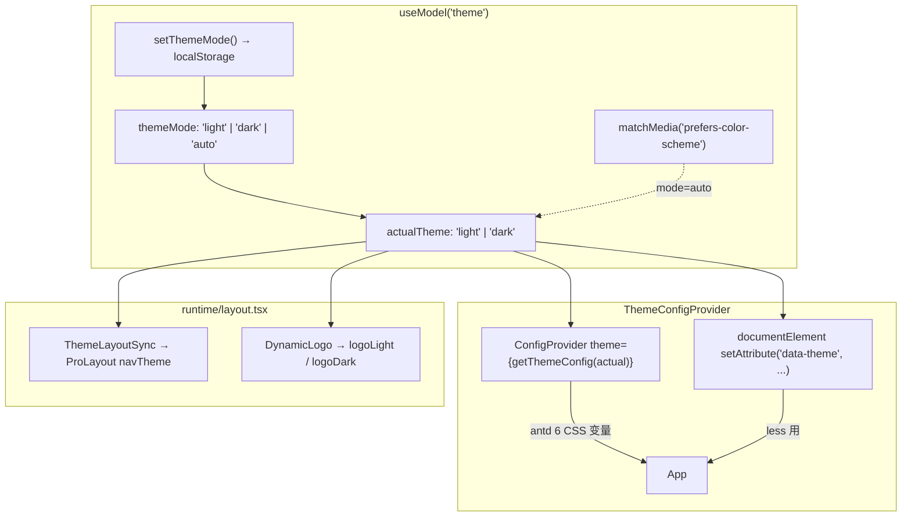

# 前端主题系统

> 范围：`stockManager/front/` 下主题相关实现（状态、token、Provider、less、盈亏颜色、构建配置）。

## 阅读指引

- **改主题色 / 组件 token**：先看 §2 主题 Token + §1 模型接口
- **主题切换出 bug**：看 §3 Provider 注入 + §4 ProLayout 同步
- **新增暗夜 less 样式**：看 §7 Less 覆盖规则
- **调盈亏颜色**：看 §6 盈亏颜色体系
- **改 Logo / 默认配置**：看 §8 + §9

## 文件索引

| 文件 | 职责 |
|------|------|
| `front/src/models/theme.ts` | 主题状态（light/dark/auto），localStorage 持久化 |
| `front/src/theme/themeConfig.ts` | antd 两套 ThemeConfig + providerComponentConfig |
| `front/src/runtime/providers.tsx` | `ThemeConfigProvider`：ConfigProvider + `data-theme` 注入 |
| `front/src/components/ThemeLayoutSync.tsx` | 同步 `actualTheme` → ProLayout `navTheme` |
| `front/src/components/RightContent/ThemeSwitch.tsx` | 顶部 Dropdown 三模式切换 |
| `front/src/hooks/useProfitLossColors.ts` | 红涨绿跌颜色 hook |
| `front/src/runtime/layout.tsx` | `DynamicLogo` 明暗 Logo 切换 |
| `front/src/global.less` | 全局 CSS 变量用法 |
| `front/src/styles/variables.less` | Less 变量（全局自动注入） |
| `front/src/components/Common/modal/index.less` | `[data-theme='dark']` 选择器示例 |
| `front/src/components/RightContent/index.less` | `.dark` class 规则 |
| `front/config/defaultSettings.ts` | ProLayout 默认配置（Logo URLs 等） |
| `front/config/config.ts` | `antd.style: 'css'` + `lessLoader.additionalData` |

## 架构总览



- **热切换**：antd 6 `style: 'css'`，不改 `key` 不 remount，无闪烁
- `ThemeLayoutSync` 用 `useLayoutEffect`（非 `useEffect`），与 token 同帧落盘，避免 ProLayout 旧 `navTheme` 闪一帧

## 1. 主题状态（`models/theme.ts`）

类型：`ActualTheme = 'light' | 'dark'`，`ThemeMode = ActualTheme | 'auto'`

| 要点 | 说明 |
|------|------|
| 存储 | `localStorage`，key `stock-manager-theme-mode` |
| 默认 | `'auto'`（跟随系统） |
| 系统检测 | `window.matchMedia('(prefers-color-scheme: dark)')` |
| 自动响应 | `mode === 'auto'` 时监听 `change` 事件同步 `actualTheme` |

对外接口：`{ themeMode, actualTheme, setThemeMode }`。

## 2. 主题 Token（`theme/themeConfig.ts`）

### 常量与语义

| 常量 | 值 | 用途 |
|------|-----|------|
| `PRIMARY_COLOR` | `#1677ff` | 主色，与 `variables.less` 同步 |
| `STOCK_LOSS_COLOR` | `#389e0d` | 下跌绿（白天），略深于 antd 默认 success |
| `STOCK_LOSS_COLOR_DARK` | `#3c8618` | 下跌绿（暗夜） |

**注意**：`colorSuccess` = 下跌绿，与 `colorError`（涨红）语义互换，适配中国股市习惯。

### 共享组件覆盖

| 组件 | 覆盖项 |
|------|--------|
| Layout | `headerHeight: 56`, `headerBg: '#ffffff'`, `bodyBg: '#f5f7fa'` |
| Menu | `itemSelectedColor` = `PRIMARY_COLOR` |
| Table | `headerBg: '#fafafa'`, `rowHoverBg: '#f5f7fa'`, `cellPaddingBlock: 12` |
| Card | `paddingLG: 20` |
| Statistic | `titleFontSize: 13`, `contentFontSize: 28` |

### 暗夜覆盖（仅差异项）

| Token / 组件 | 白天 | 暗夜 |
|-------------|------|------|
| `colorBgLayout` | `#f5f7fa` | `#141414` |
| `colorBgContainer` | `#ffffff` | `#1f1f1f` |
| `colorSuccess` | `#389e0d` | `#3c8618` |
| `colorText` | `rgba(0,0,0,0.88)` | `rgba(255,255,255,0.85)` |
| Layout `headerBg` | `#ffffff` | `#1f1f1f` |
| Layout `bodyBg` | `#f5f7fa` | `#141414` |
| Table `headerBg` | `#fafafa` | `#262626` |
| Table `rowHoverBg` | `#f5f7fa` | `#262626` |
| Table `borderColor` | `#f0f0f0` | `#303030` |

导出：`getThemeConfig(actualTheme)` + `providerComponentConfig`（mask blur 恢复 antd 6.0~6.2 行为）→ 由 §3 Provider 消费。

## 3. Provider 注入（`runtime/providers.tsx`）

`app.tsx` 通过 `innerProvider` 注册，包裹整棵 React 树：

```
ThemeConfigProvider
├─ documentElement.setAttribute('data-theme', actualTheme)  // useLayoutEffect
├─ ConfigProvider theme={getThemeConfig(actualTheme)}        // CSS 变量热切换
├─ providerComponentConfig                                   // mask blur
└─ App
```

**不**用 `key={actualTheme}` remount：antd 6 CSS 变量模式天然热切换，remount 会清空子树状态且让 navTheme/data-theme 慢一帧。

## 4. ProLayout 同步（`ThemeLayoutSync.tsx`）

```typescript
useLayoutEffect(() => {
  setInitialState(s => ({
    ...s,
    settings: {
      ...s?.settings,
      navTheme: actualTheme === 'dark' ? 'realDark' : 'light',
      colorPrimary: PRIMARY_COLOR,
      fixedHeader: true,
    },
  }));
}, [actualTheme]);
```

在 `layout.tsx` 的 `childrenRender` 中渲染，与 token 同帧生效，避免 ProLayout `navTheme` 闪旧值。

## 5. 主题切换 UI（`ThemeSwitch.tsx`）

顶部 `RightContent` 内 Dropdown，三项：

| 模式 | 标签 | 图标 |
|------|------|------|
| `light` | 白天模式 | `SunOutlined` |
| `dark` | 暗夜模式 | `MoonFilled` |
| `auto` | 跟随系统 | `DesktopOutlined` |

`selectedKeys` 高亮当前项，`onClick` → `setThemeMode(key)`。

## 6. 盈亏颜色体系

中国股市红涨绿跌，与 antd 默认语义相反：

| 方向 | 对应 token | 白天色值 | 暗夜色值 |
|------|-----------|----------|----------|
| 涨（盈利） | `colorError` | `#ff4d4f` | `#a61d24` |
| 跌（亏损） | `colorSuccess` | `#389e0d` | `#3c8618` |

`useProfitLossColors()` hook 返回 `{ profitColor, lossColor, colorFromValue(v), highlightStyle }`。所有盈亏组件（`HoldingsList`、`OverallBoard`、`AnalysisList`、`TradeDetailModal`、`StockProfitModal` 等）统一通过此 hook 取色，随主题自动切换。

## 7. Less 暗夜覆盖

### `[data-theme='dark']` 选择器

仅需绕过 antd token 的 less 中使用，当前两处：

| 文件 | 覆盖内容 |
|------|----------|
| `modal/index.less` | 分隔线 `border-top-color`、表头 `background-color` 改为暗色 |
| `RightContent/index.less` | `.dark` class：avatar 背景、action hover 背景 |

### 全局样式（`global.less`）

优先使用 antd 6 CSS 变量：`var(--ant-color-bg-layout)`、`var(--ant-color-text)`。

### Less 变量（`variables.less`）

```less
@primary-color: #1677ff;    // 与 themeConfig.ts 同步
@page-padding: 16px;
@screen-md: 768px;
```

通过 `config.ts` `lessLoader.additionalData` 自动注入所有 `.less` 文件。

## 8. Logo 明暗切换

`layout.tsx` 的 `DynamicLogo` 根据 `actualTheme` 选择：

| 主题 | 字段 | URL |
|------|------|-----|
| light | `logoLight`（fallback `logo`） | `...pVXld8U.png` |
| dark | `logoDark`（fallback `logo`） | `...ca6i9S.png` |

默认值在 `config/defaultSettings.ts`。

## 9. 构建配置要点

`config/config.ts` 中与主题相关的两项：

```typescript
{
  antd: { style: 'css' },                              // antd 6 CSS 变量模式
  lessLoader: { additionalData: `@import "variables.less";` }, // 全局 Less 变量
}
```

## 10. 修改导航

| 目标 | 改动位置 |
|------|----------|
| 主题色 | `theme/themeConfig.ts` → `PRIMARY_COLOR` → 同步 `variables.less`、`defaultSettings.ts` |
| 组件 token | `theme/themeConfig.ts` → `sharedComponents` 或两主题 `components` |
| 新增暗夜 less | 目标 `.less` → `[data-theme='dark'] & { ... }` |
| 盈亏颜色 | `hooks/useProfitLossColors.ts` → `getProfitLossColors()` |
| 切换 UI | `RightContent/ThemeSwitch.tsx` |
| 默认主题 / Logo | `config/defaultSettings.ts` |
| 新增 CSS 变量 | 直接 `var(--ant-xxx)`，antd 6 自动注入 |
