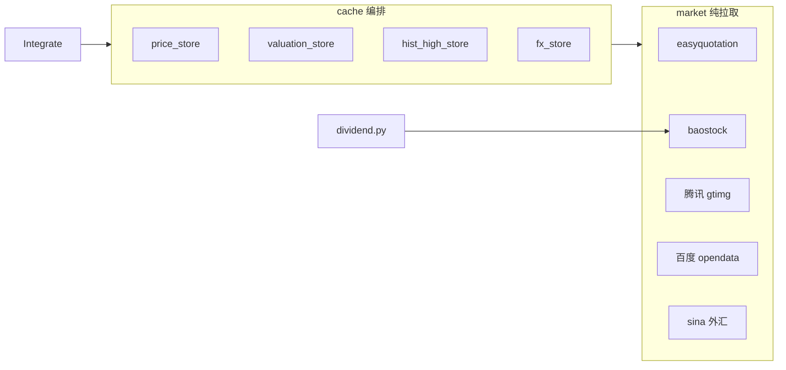

# 外部数据获取

> 范围：`stockManager/backend/services/market/` 纯拉取层 + `services/cache/` 缓存编排 + `services/dividend.py` 除权业务。缓存键与 TTL 详见 [缓存机制分析.md](./缓存机制分析.md)。

## 1. 架构分层

- **market/**：仅负责外部拉取与字段标准化，不含 Redis 逻辑。
- **cache/**：按 key/TTL 做 read-through；`Integrate` 经 `CacheRepository` 门面调用。
- **dividend.py**：除权除息业务编排（持仓判定、去重、写库），拉取委托 `market.baostock_source`。

## 2. 数据源 × 市场对照

| 数据类型 | A 股 | 港股 | market 模块 | 缓存 key | TTL |
|---------|------|------|-------------|----------|-----|
| 实时价 | easyquotation `tencent` | easyquotation `hkquote` | `realtimePrice.fetch_prices` | `stock:price:{code}` | 86400s |
| PE/PB（epsTtm/bvps） | baostock `peTTM`/`pbMRQ` | 百度 opendata | `baostock_source` / `baiduValuation` | `stock:valuation:{code}` | 86400s |
| 6 年历史最高 | baostock 周线前复权 | 腾讯 gtimg 周线不复权 | `baostock_source` / `historicalHigh` | `stock:hist_high:{code}` | 86400s |
| HKD/CNY 汇率 | — | sina `fx_shkdcny` | `exchangeRate.fetch_hkd_cny_rate` | `fx:hkd_cny` | 86400s |
| 除权除息 | baostock `query_dividend_data` | 不支持 | `baostock_source.fetch_dividends` | 无（直写 DB） | — |

## 3. 各源说明

### easyquotation（实时价）

- **文件**：`market/realtimePrice.py`
- **A 股**：`use('tencent').real(codes, prefix=True)` → `currentPrice`、`yesterdayClose`；`yearHigh` 取自 `high_2` 字段。
- **港股**：`use('hkquote').real([5位代码])`；`yearHigh` 取自 `year_high` 字段。
- **实例复用**：easyquotation 实例经模块级 `_quotations` 字典缓存，避免重复初始化。
- **刷新策略**：`price_store` 按市场（CN/HK）判断交易时段与收盘后是否需刷新；价格更新时清全部 `calculated_target`。

### baostock（A 股估值 / 历史高 / 除权）

- **文件**：`market/baostock_source.py`
- **会话**：`baostock_session()` 上下文统一 `login/logout`。
- **估值**：`fetch_cn_valuation` — 近 30 日日线取最新 `peTTM`/`pbMRQ`/`close`；store 换算 `epsTtm=close/peTTM`、`bvps=close/pbMRQ`。
- **历史高**：`fetch_cn_hist_highs` — 6 年周线前复权（`adjustflag=2`）取 `max(high)`。
- **除权**：`fetch_dividends` — 按年 `query_dividend_data`，返回 `{date, cash, reserve, stock}` 行列表。

### 百度 opendata（港股 PE/PB）

- **文件**：`market/baiduValuation.py`
- **仅港股**：`fetch_pe_pb(pure_code, 'hk')`；A 股已改走 baostock。
- **HTTP**：经 `market/http_client.get_json` 共享 Session。

### 腾讯 gtimg（港股历史高）

- **文件**：`market/historicalHigh.py`
- **仅港股**：`fetch_hk_hist_high(hkXXXXX)` — 6 年周线不复权（`bfq`）。
- **HTTP**：经 `market/http_client.get_json`。

### sina 外汇（HKD/CNY）

- **文件**：`market/exchangeRate.py`
- **接口**：`https://hq.sinajs.cn/list=fx_shkdcny`，须带 `Referer: https://finance.sina.com.cn/`。
- **解析**：响应 `var hq_str_fx_shkdcny="名称,现价,..."`，第 2 字段为 HKD/CNY。
- **HTTP**：经 `market/http_client.get_text` 共享 Session。
- **缓存配合**：`fx_store` 非交易时段**优先读** Redis `fx:hkd_cny`（命中则不发请求）；交易时段强制回源并回写。拉取失败异常上抛（无失败后回落缓存的逻辑），由视图层 `@handle_exception` 兜底。

## 4. 调用路径

| API / 功能 | 入口 | 外部数据 |
|-----------|------|---------|
| `GET /api/stocks` | `Integrate.get_calculated_result` | 实时价、汇率（始终加载：非交易时段读缓存，否则回源） |
| `GET /api/watchlist` | `Integrate.get_watchlist` | 实时价、估值、历史高 |
| `POST /api/dividend` | `Integrate.generate_dividend` | baostock 除权除息 |

## 5. 失败行为

| 源 | 失败时 |
|----|--------|
| easyquotation | 记录 error 日志，返回空 dict，页面缺价 |
| baostock | 记录 error 日志，单 code 返回 None / 空估值 |
| 百度 / gtimg | 记录 error 日志，返回 None；hist 写 `__none__` sentinel 防重复请求 |
| sina 外汇 | 抛异常（解析失败 / 无效汇率均 raise），由视图层 `@handle_exception` 兜底；非交易时段因优先读缓存通常不触发请求 |

## 6. 依赖

| 库 | 用途 |
|----|------|
| easyquotation | A/H 实时价 |
| baostock | A 股估值、历史高、除权 |
| requests | `http_client`（百度、gtimg、sina） |

已移除：**akshare**（汇率改 sina）。
