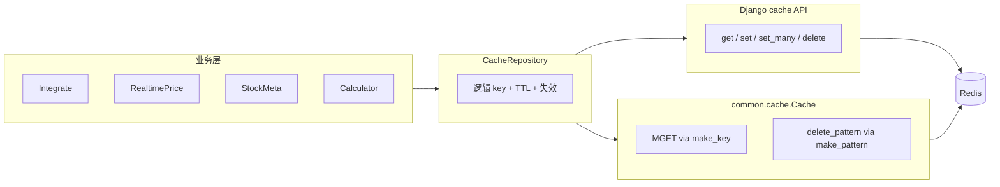

# Backend 缓存机制完整分析

> 范围：`stockManager/backend` 目录下实际生效的缓存相关实现（键设计、数据内容、过期策略、失效策略、调用路径、代码结构）。

## 1. 总览：缓存分层与职责

当前后端缓存是一个 **两层结构**：

1. **Django Cache（业务接口层）**
   - 业务与 `CacheRepository` 统一使用 **逻辑 key**（如 `user:1:operations`），单条通过 `cache.get` / `cache.set` / `cache.delete`；批量读写通过 `Cache.get_many` / `Cache.set_many`。
   - 由 Django 根据 `KEY_PREFIX`、`VERSION` 自动拼出 Redis 完整 key，业务代码无需关心前缀。
2. **Redis 原生能力（优化层）**
   - 批量读、按模式删除在 `backend/common/cache.py` 中通过 `get_redis_connection` 直连 Redis。
   - 完整 key / pattern 统一用 `cache.make_key` 或 `Cache.make_pattern` 生成，**不再手写** `stockmanager:1:` 之类字符串。

对应代码分工：

| 层级 | 文件 | 职责 |
|------|------|------|
| 配置 | `stockManager/settings.py` | `RedisCache`、`KEY_PREFIX`、`VERSION`、JSON 序列化 |
| 工具 | `backend/common/cache.py` | `make_key` / `make_pattern`、`get_many`（MGET）、`set_many`（Pipeline）、`delete_pattern` |
| 仓库 | `backend/services/cacheRepository.py` | 逻辑 key 常量、TTL、读写/失效策略、业务缓存入口 |
| 业务 | `integrate.py`、`realtimePrice.py`、`stockMeta.py`、`stockNameSync.py`、`calculator.py` | 经 `CacheRepository` 使用缓存 |
| 接口 | `backend/views/stock.py` | `/api/stocks` 读计算结果；`POST /api/clearCache` 全量清理 |



## 2. 基础配置与 key 约定

### 2.1 settings 配置

在 `settings.py` 中：

- 后端：`django_redis.cache.RedisCache`
- `LOCATION`：环境变量 `REDIS_URL`
- 序列化：`JSONSerializer`
- 命名空间：`KEY_PREFIX='stockmanager'`，`VERSION=1`

Redis 中实际 key 示例（由框架生成，**不要在业务里拼接**）：

- `stockmanager:1:user:123:operations`
- `stockmanager:1:stock:price:sh600519`

### 2.2 逻辑 key vs 完整 key（开发约定）

| 场景 | 使用方式 |
|------|----------|
| 单条读写 | 只传逻辑 key，与 `CacheRepository` 常量一致 |
| `Cache.set_many` | 入参为逻辑 key 映射；内部 `make_key` + 与 `cache.set` 相同的序列化与超时 |
| `Cache.get_many` | 入参为逻辑 key 列表；内部 `cache.make_key` 后 `MGET` |
| `Cache.delete_pattern` | 默认 `logical=True`，传逻辑通配符如 `user:*:calculated_target`、`*` |
| 调试 Redis | 可用 `Cache.make_key('user:1:operations')` 查看完整 key |

`CacheRepository` 中所有 `KEY_*` 常量均为 **逻辑 key 模板**，格式化后交给 Django 或 `Cache` 工具层处理。

## 3. 缓存内容清单（缓存什么）

`CacheRepository` 定义的核心缓存对象：

1. **用户操作流水**
   - Key：`user:{user_id}:operations`
   - 内容：按股票代码分组后的 `Operation` 列表（JSON 字符串存库，读出后反序列化为带 `ModelState` 的实例）
   - 用途：操作列表、收益计算、分红生成

2. **用户现金信息**
   - Key：`user:{user_id}:cash_info`
   - 内容：`income_cash`、`cash_flow_list`
   - 用途：收益汇总 `calculate_overall`

3. **用户计算结果（聚合）**
   - Key：`user:{user_id}:calculated_target`
   - 内容：`{"stocks": ..., "overall": ...}`（`CalculatedResult`）
   - 用途：`/api/stocks` 直接返回，避免重复计算

4. **股票元数据全量字典**
   - Key：`stock:meta:all`
   - 内容：`{code: {code, name, isNew, stockType}}`
   - 用途：避免反复全表读 `StockMeta`

5. **股票实时价格（单票）**
   - Key：`stock:price:{code}`
   - 内容：`RealtimePriceData`（name / currentPrice / priceOffset / offsetRatio / yesterdayClose）
   - 用途：行情展示；`Calculator` 经 `RealtimePrice.query` 间接使用

6. **股票价格时间戳**
   - Key：`stock:price:timestamp`
   - 内容：上海时区 ISO 时间字符串
   - 用途：非交易时段判断价格缓存是否“逻辑过期”

7. **股票名称日同步标记**
   - Key：`stock:name:sync:daily`
   - 内容：当日日期 `YYYY-MM-DD`
   - 用途：限制「根据实时行情回写名称」每天最多一次

## 4. TTL 策略

`CacheRepository` 常量：

| 常量 | 秒数 | 说明 |
|------|-----:|------|
| `TTL_USER_DATA` | 36000 | 用户 operations / cash_info，10 小时 |
| `TTL_CALCULATED_TARGET` | 86400 | 计算结果，24 小时 |
| `TTL_STOCK_META` | 86400 | 元数据全量，24 小时 |
| `TTL_STOCK_PRICE` | 86400 | 单票价格与时间戳，24 小时 |

补充：

- `stock:name:sync:daily`：TTL 动态为「到次日 00:00（上海）+ 60 秒」，自然日边界重置。
- 多个 key 虽为 24h TTL，**是否命中还受交易时段逻辑失效约束**（见下节），逻辑上可能早于物理过期。

## 5. 刷新 / 失效策略

### 5.1 交易时段驱动的逻辑失效

核心：`CacheRepository._should_refresh_cache()`。

- **当前在交易时段**（`TradingCalendar.is_current_time_in_trading_hours()`）→ 视为需刷新：不用 `calculated_target`，批量价格也全部视为未命中。
- **不在交易时段**：
  1. 读 `stock:price:timestamp`
  2. 无时间戳 → 刷新
  3. 有时间戳 → `TradingCalendar.is_trading_time_passed(cached_time, now)`：两时刻之间若经历过交易时段则刷新

解决「TTL 未过但市场已开盘，旧价/旧收益不应继续用」的问题。

相关行为：

- `get_calculated_target`：需刷新时直接返回 `None`
- `set_calculated_target`：**交易时段内不写**计算结果缓存
- `get_stock_prices_with_cache`：需刷新时返回空命中 + 全量 `missing_codes`

### 5.2 数据变更驱动的主动失效

| 触发源 | 行为 |
|--------|------|
| `Operation` / `CashFlow` / `Info(INCOME_CASH)` 的 `post_save` / `post_delete` | `integrate.clear_integrate_cache` → `clear_user_cache`（operations、cash_info、calculated_target） |
| `Integrate.update_income_cash` | 更新 DB 后同上 |
| `StockMeta` 的 `post_save` / `post_delete` | `clear_stock_meta_all` |
| `set_stock_price_timestamp`（含批量写价后） | 更新时间戳 + `clear_all_calculated_targets`（pattern `user:*:calculated_target`） |
| `StockNameSync` 有名称变更并 `bulk_update` 后 | `clear_stock_meta_all` + `mark_stock_name_synced` |
| `POST /api/clearCache` | `clear_all()` → `delete_pattern("*")` 删除本应用命名空间下全部 key |

### 5.3 失效链示意（价格更新）

```text
RealtimePrice.query → API 回源 → set_stock_prices_batch
  → Cache.set_many(各 stock:price:{code})
  → set_stock_price_timestamp
       → clear_all_calculated_targets (所有用户的 calculated_target)
```

保证价格变更后不会继续返回基于旧价的聚合收益缓存。

## 6. 读写路径与命中行为

### 6.1 用户操作与计算结果

`views/stock.py` → `Integrate.get_calculated_result`：

1. `get_calculated_target`（内含交易时段 / 时间戳判断）
2. 未命中 → `get_user_operations` + `get_user_cash_info`（各自 cache-aside）
3. `Calculator.calculate_stock_list` / `calculate_overall`
4. `set_calculated_target`（交易时段内跳过写入）

`/api/stocks` 主要依赖 `calculated_target`；交易时段强制重算以保证实时性。

`Integrate.get_operations`、`generate_dividend` 仅使用 `get_user_operations`，不读 `calculated_target`。

### 6.2 实时价格（批量读 + 写）

`RealtimePrice.query`：

1. `get_stock_prices_with_cache` → 逻辑失效检查 → `get_stock_prices_batch`
2. 命中部分直接返回；`missing_codes` 走 `fetch_from_api`（easyquotation）
3. `set_stock_prices_batch` 回写并刷新时间戳

**批量读**：`Cache.get_many(逻辑 keys)` → `make_key` + Redis `MGET` + `client.decode`；未命中为 `None`；异常时降级为逐 key `cache.get`。

**批量写**：`Cache.set_many(逻辑 key 映射)` → Pipeline 内逐条走 `cache.client.set`（与单条 `cache.set` 相同的 `make_key`、JSON 序列化、`px` 超时）；异常时降级为逐 key `cache.set`。

### 6.3 股票名称同步

`fetch_from_api(..., sync_names=True)` → `StockNameSync.sync_from_realtime`：

- 24 小时内已同步（`stock:name:sync:mark` TTL 86400s）→ 跳过
- 无名称变更 → 仅 `mark_stock_name_synced`
- 有变更 → `bulk_update` → `clear_stock_meta_all` → 标记已同步

### 6.4 计算器与行情

`calculator.py` 在算持仓市值时调用 `RealtimePrice.query(code_list)`，因此计算链路间接依赖价格缓存与 5.1 的逻辑失效，**不单独维护**计算器级缓存。

## 7. 底层工具与健壮性

`backend/common/cache.py`：

| 方法 | 作用 | 失败时 |
|------|------|--------|
| `make_key` / `make_pattern` | 逻辑 key / 通配 → Redis 完整形式 | — |
| `get_many` | `MGET` + `client.decode`（与 `cache.get` 同链路） | 逐 key `cache.get` |
| `set_many` | Pipeline + `client.set`（逻辑 key） | 逐 key `cache.set` |
| `delete_pattern` | `KEYS` + `DELETE`，默认逻辑 pattern | 返回 0，不抛异常 |

注意：`KEYS` 在 key 数量极大时可能阻塞 Redis；当前规模可接受，规模增大时可改为 `SCAN` 分批删除。

仓库层对批量读/写另有 `logger.error` 记录（如 `get_stock_prices_batch`、`set_stock_prices_batch` 降级），比工具层静默回退多一层可观测性。

## 8. 评估：优点与待改进点

### 8.1 优点

- **集中式缓存仓库**：key、TTL、失效集中在 `CacheRepository`，业务侧调用简单。
- **逻辑 key 统一**：前缀/版本由 `make_key` / `make_pattern` 与 Django cache 承担，避免与 settings 漂移。
- **实时与性能平衡**：交易时段逻辑失效 + 非交易时段批量 MGET。
- **失效链完整**：用户数据、价格时间戳、元数据、管理员清缓存均有覆盖。

### 8.2 待改进点（非阻塞）

1. **pattern 删除使用 KEYS** — 数据量大时改 `SCAN`。
2. **Operation 反序列化** — `_deserialize_operations` 用 `Operation.__new__` + `ModelState`，与 ORM 内部结构耦合；可考虑缓存 DTO，在上层再转模型。
3. **异常与监控** — 工具层大量吞异常；可对回退次数、pattern 删除失败做指标/告警。

## 9. 策略速查表

| 缓存项 | 逻辑 Key | TTL | 读取策略 | 失效策略 |
|--------|----------|----:|----------|----------|
| 用户操作 | `user:{id}:operations` | 10h | miss 查 DB 并写缓存 | 用户相关模型 save/delete；`update_income_cash` |
| 用户现金 | `user:{id}:cash_info` | 10h | 同上 | 同上 |
| 计算结果 | `user:{id}:calculated_target` | 24h | 交易时段或跨交易时段视为失效；否则命中 | 用户数据变更；价格时间戳更新后 pattern 清全用户 |
| 元数据全量 | `stock:meta:all` | 24h | miss 全表加载并缓存 | StockMeta 信号；名称同步有变更 |
| 实时价格 | `stock:price:{code}` | 24h | 批量 MGET + 缺失回源 API | 5.1 逻辑失效；TTL 自然过期 |
| 价格时间戳 | `stock:price:timestamp` | 24h | 供逻辑失效判断 | 每次批量写价覆盖 |
| 名称日同步 | `stock:name:sync:daily` | 至次日 00:00+60s | 控制每日最多同步一次 | 次日过期 |

## 10. 新增缓存时的检查清单

1. 在 `CacheRepository` 增加 `KEY_*` 常量（逻辑 key）与 `TTL_*`（如需）。
2. 单条读写用 `cache.get/set/delete`；批量读写用 `Cache.get_many` / `Cache.set_many`；模式删除用 `Cache.delete_pattern`。
3. 明确是否需要接入 `_should_refresh_cache` 或用户/元数据信号失效。
4. 勿在业务代码手写 `stockmanager:1:`；调试时用 `Cache.make_key`。
5. 更新本文档第 3、9 节表格。

## 11. 关键代码入口索引

- 缓存配置：`stockManager/settings.py`（`CACHES`）
- 缓存仓库：`backend/services/cacheRepository.py`
- Redis 工具：`backend/common/cache.py`
- 交易时段：`backend/common/tradingCalendar.py`
- 用户数据与信号：`backend/services/integrate.py`
- 实时行情：`backend/services/realtimePrice.py`
- 名称同步：`backend/services/stockNameSync.py`
- 元数据：`backend/services/stockMeta.py`
- 收益计算（间接用价缓存）：`backend/services/calculator.py`
- API：`backend/views/stock.py`（`get_stocks`、`clear_cache`）
